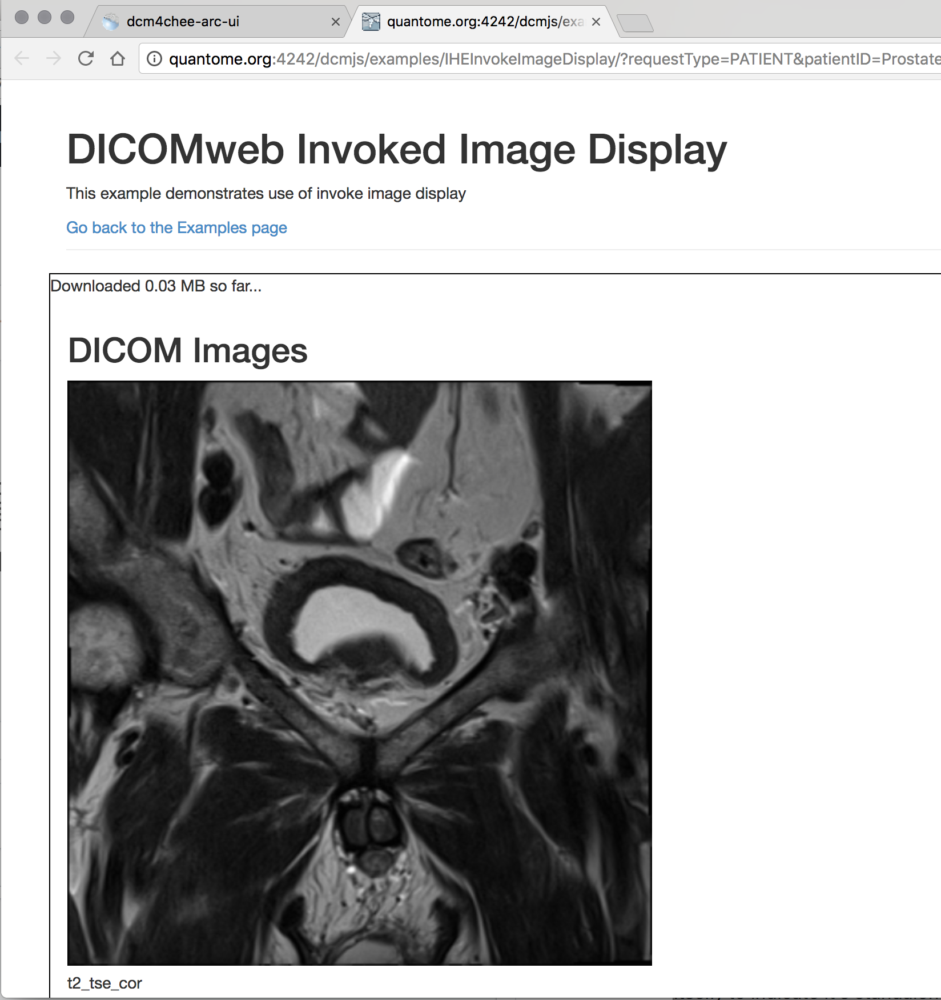

Back to [Projects List](../../README.md#ProjectsList)

# DCMJS+Cornerstone Utilities

## Key Investigators

- Steve Pieper (Isomics)
- Erik Ziegler (OHIF)
- Alireza Mehrtash (BWH/UBC)
- Alireza Sedghi (BWH/Queen's University)

## Project Description

## Objective

1. Continue development of pure-javascript dicom utilities for manipulating data in web applications.
1. Integrate visualization and display elements.
1. Create utilities that perform useful work.

This project also covers a grab bag of backlog issues related to segmentation and structured reporting in DCMJS, Cornerstone, and the OHIF Viewer packages.

Some potential goals for this Project Week are:
  - Create lightweight single-page segment editor prototype for loading / editing / resaving DICOM Segmentations with DCMJS & Cornerstone
  - Improve performance of loaded DICOM Segmentation files by implementing proposed non-overlapping segment flag support
  - Add missing WebGL rendering paths for label maps and false color images in Cornerstone Core
  - Mock up & implement UI for DICOM Segmentation display in OHIF Viewer
  - Research potential DICOM SR templates for storage and retrieval of annotations for OHIF Viewer (e.g. length tool, etc...)
  - Check what is still missing to support image segmentation use cases for Tobias Penzkofer (Charité Universitätsmedizin, Berlin) & Felix Nensa (University Hospital Essen)
  - Add documentation to [Cornerstone Tools Documentation](https://tools.cornerstonejs.org/) for segmentation tools
  - Add display support for fractional segmentation maps to WADO Image Loader

## Approach and Plan

1. Brainstorm to define useful utilities, such as client-side deidentification, data organization, previewing, format conversion, online markup or segmentation tool...
1. Experiment with [DICOMweb](http://dicomweb.org) APIs
1. Design, implement, and test prototypes
1. Get community feedback

## Progress and Next Steps

<!--Describe progress and next steps in a few bullet points as you are making progress.-->
1. Discussed DICOMweb prototype with cornerstone
1. IHEInvokeImageDisplay demonstration launched from dcm4chee
1. ProstateX data loaded in dcm4chee and launchable at Patient level to display all series
1. Next Step: integrate with PI-RADS project progress

# Illustrations

<!--Add pictures and links to videos that demonstrate what has been accomplished.-->

<!---->

# Background and References

<!--Use this space for information that may help people better understand your project, like links to papers, source code, or data.-->

- [Source code](https://github.com/pieper/dcmjs)
- [Examples](https://pieper.github.io/dcmjs/examples)
