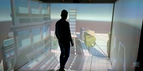
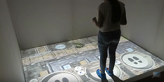

Back to [Projects List](../../README.md#Projects)

# 3DSlicer Models for Serious Games

## Key Investigators

- Sergi Bermudez i Badia (M-ITI - MACbioIDi)
- Yuri Almeida (M-ITI - MACbioIDi)
- Artemisa Moreno (UCV - MACbioIDi)
- María Dolores Afonso-Suárez (ULPGC - GTMA - MACbioIDi)
- Juan Ruiz-Alzola (ULPGC - GTMA - MACbioIDi)

## Project Description

- Designing scenarios for Serious Games from 3DSlicer models.

Serious games, are designed for a purpose other than pure entertainment. The M-ITI serious games projects -among others- are developed to exploit specific brain mechanisms that relate to functional recovery to approach motor and cognitive rehabilitation by means of non-invasive and low-cost technologies.
[M-ITI NeuroRehabLab](https://neurorehabilitation.m-iti.org/lab/)
In the case of this project, M-ITI collaborates with the ULPGC-IUIBS MACbioIDi in a joint work proposed for the areas of education, scientific and medical projects.
[IUIBS MACbioIDi](https://mt4sd.ulpgc.es/w/index.php/Proyecto_MACbioIDi)
The objective of this project is to create applications within the concept of Serious Game, by using scenarios developed in Unity -the cross platform game engine-.
These scenarios will be using models of images imported from 3DSlicer.

## Objectives

1. Understand the documentation involved in the import/export formats used.
1. Choose the best approach to the solution.
1. Create Unity scenarios to interact with the models.

## Approach and Plan

1. Tests abut how to import/export files and their formats.
1. Study other scenarios previously implemented.
1. Plan the development of new scenarios to create and standardize.

## Progress and Next Steps

## Illustrations

Export / Import example.

Unity Scenario example.

## Background and References

+ [Virtual Reality with Customized Positive Stimuli in a Cognitive-Motor Rehabilitation Task: A feasibility study with subacute stroke patients with mild cognitive impairment
Mónica S. Cameirão, Fábio Pereira, Sergi Bermúdez i Badia](https://neurorehabilitation.m-iti.org/lab/wp-content/plugins/zotpress/lib/request/request.dl.php?api_user_id=161215&key=4ZQMQFB3&content_type=application/pdf)

