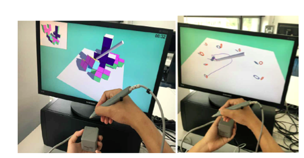

Back to [Projects List](../../README.md#ProjectsList)

# Intelligent and Adapative Minimally Invasive Surgery Simulation 

## Key Investigators

- Tina Vajsbaher (University of Bremen, Germany) - Travel funding from Erasmus + Staff Mobility Grant
- Csaba Pinter (Queen's University, Canada)
- Andras Lasso (Queen's University, Canada)
- Juan Ruiz-Alzola (ULPGC - GTMA - MACbioIDi, Spain)
- Gino Gulamhussene (University of Magdeburg, Germany)
- Miguel Angel Rodriguez Florido (Laboratorio de Simulación y Formación basada en Tecnología, Spain)
- Javier González Fernández (Instituto Tecnológico de Canarias, Spain)
- Donato Monopoli (Instituto Tecnológico de Canarias, Spain)

## External Investigators
- Holger Schultheis (University of Bremen)
- Ron Kikinis (University of Bremen & Harvard Medical School)

# Project Description

This project focuses on designing and implementing an intelligent and adaptive MIS surgical training system, which would allow a user to obtain relevant cognitive, motoric and non-technical skills, within a game based environment. The goal is to design a simulation system, which would track, monitor and adapt to the overall performance of the user. 

## Objective

The objective is to create a MIS simulation system, which would analyse and monitor the users performance and would adept to the complexity of the task accordingly.

1. Objective A. Design MIS related, and game based, tasks
1. Objective B. Simulate the movement of the physical instruments inside the game
1. Objective C. Apply AI methods to make the simulator more intelligent and adapative

## Approach and Plan

1. Designing user-interface and Unity based games, to simulate MIS conditions 
1. Implimentation and use of the metrices from the PerkTutor and SlicerIGT 
1. Synchronisation of the MIS instruments (optical tracker) with the Unity based game
1. Exploration and implimentation of AI methods (Student modelling, intelligent tutoring system) for the game application

## Progress and Next Steps

1. Brainstorming the methods for the optimal instrument calibration of the optical tracker
1. Liasing with the Simulation Lab at the University Complejo Hospital, for optimising the proposed simulation for clinical use
1. Next step: Work closely with the PerkLab using PerkTutor and SlicerIGT for laparoscopy CBME training for the Unity-based application for simulation “games” using 3D-printed laparoscopy tools. Incorporating information about respiratory organ movement into the simulation.
1. Find a way to accurately track the MIS instruments, using the metrics collected and calculated by the PerkTutor 

# Illustrations

