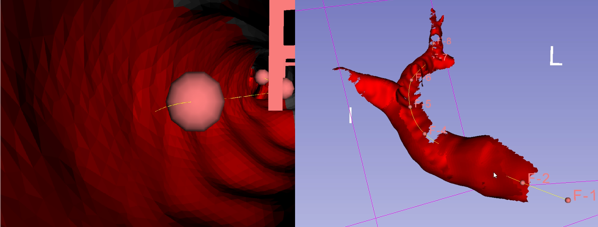

Back to [Projects List](../../README.md#ProjectsList)

# Endoscope Viewing Area Quantification

## Key Investigators

- Franklin King (Brigham and Women's Hospital)

# Project Description

<!-- Add a short paragraph describing the project. -->
With experiments with bronchoscope continuum robots, we've found a need to visualize and quantify the amount (and possibly quality) of the viewing area provided by the camera. The idea is to retopologize a model created from CT data with equally sized polygons and then "paint" the polygons viewed using a virtual endoscope camera. The intention is that the movement of the virtual camera would be tied to the movement of a real bronchoscope/robot.

## Objective

1. Create module to "paint" viewed area and record metrics

## Approach and Plan

1. Use [vtkHardwareSelector](https://www.vtk.org/doc/nightly/html/classvtkHardwareSelector.html) for the job - Testing done, works on basic level
2. Convert into quantified metrics
3. Optimization and stability
4. Add ability to retopologize meshes within Slicer itself?

## Progress and Next Steps

<!--Describe progress and next steps in a few bullet points as you are making progress.-->
1. Made and tried test Python script
2. Script works but is still unstable and results in some unexpected behaviour and crashing
3. Reimplementing as loadable module

# Illustrations

<!---->

[Video of results of test script using vtkHardwareSelector](https://youtu.be/rH_XCgG9sds)

# Background and References

<!--Use this space for information that may help people better understand your project, like links to papers, source code, or data.-->

- Source code: 
