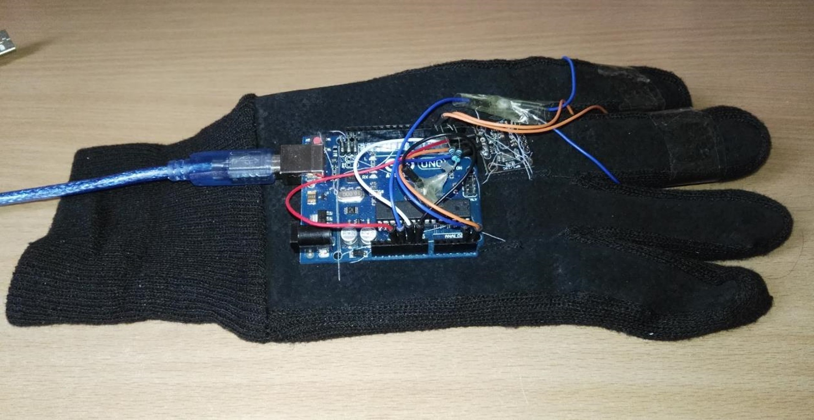
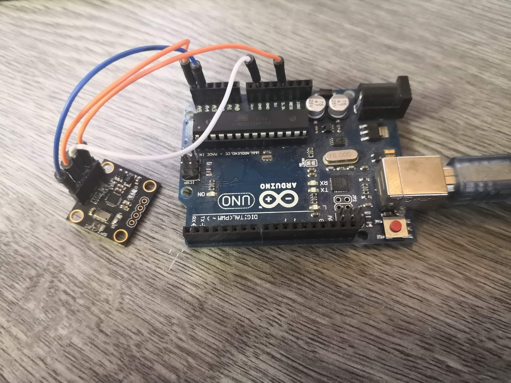
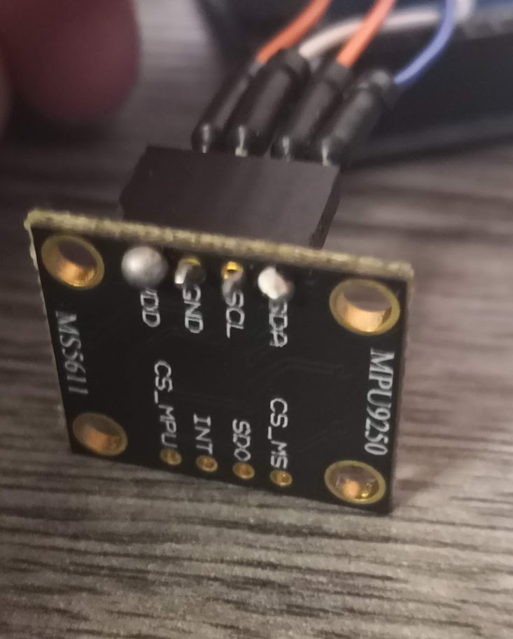

Back to [Projects List](../../README.md#ProjectsList)

# Data-glove for virtual operations

## Key Investigators

- Endre Vecsernyés (University of Szeged)
- Attila Nagy (University of Szeged)
- Kitti Farkas (University of Szeged)
- Bence Horvath (University of Szeged)
- Kyle Sunderland (Queen's University)
- Eleni Siampli (Children's National)
- ...

# Project Description

We built a data-glove that tracks hand movements. Our goal is to connect it to Slicer with OpenIGTLink or with the Plus toolkit. The glove has a simple IMU (with 3-axis gyroscope and 3-axis accelerometer /MPU9250/) and a processing unit (Arduino Uno).

## Objective

1. Stable connections between the glove and the Slicer
1. Calibrate movements

## Approach and Plan

1. TBA

## Progress and Next Steps

<!--Describe progress and next steps in a few bullet points as you are making progress.-->

# Illustrations

<!--Add pictures and links to videos that demonstrate what has been accomplished.-->

# Background and References

<!--Use this space for information that may help people better understand your project, like links to papers, source code, or data.-->
- Previous work in Slicer using PhidgetSpatial 3/3/3 sensor: http://perk.cs.queensu.ca/sites/perkd7.cs.queensu.ca/files/Kotwicz2014.pdf
- MPU9250 Datasheet: https://cdn.sparkfun.com/assets/learn_tutorials/5/5/0/MPU9250REV1.0.pdf
- Arduino Uno website: https://store.arduino.cc/arduino-uno-rev3
- MPU9250-Arduino library: https://github.com/bolderflight/MPU9250
<!--- Source code: https://github.com/YourUser/YourRepository  -->
<!--- Documentation: https://link.to.docs  -->
<!--- Test data: https://link.to.test.data  -->

