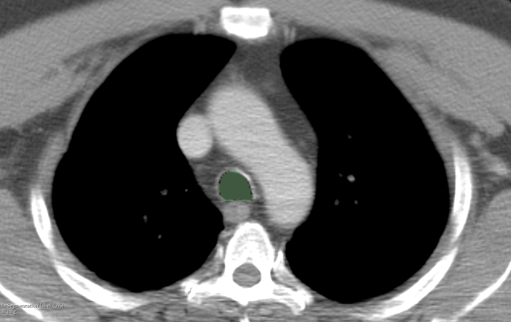
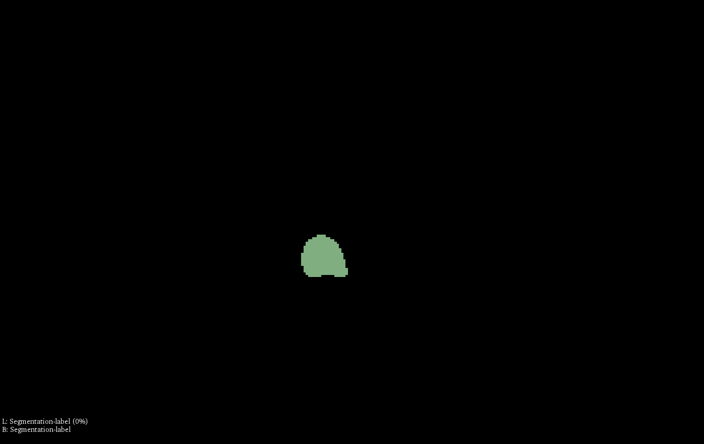

Back to [Projects List](../../README.md#ProjectsList)

# Automatic Segmentation Using Neural Network

## Key Investigators

- Bence Horvath (University of Szeged)
- Attila Nagy (Faculty of Medicine, University of Szeged)
- Kitti Farkas (University of Szeged)
- Endre Vecsernyes (University of Szeged)
- Deepak Chittajallu (Kitware) *available remotely* (deepak.chittajallu@kitware.com, [@cdeepakroy](https://github.com/cdeepakroy))

# Project Description

<!-- Add a short paragraph describing the project. -->
We want to implement a neural network based automatic segmentation algorithm to segment the upper region of airways in CT images. We have approximately 40 non segmented CT images of the neck in DICOM files, that we have to segment for the training phase. For medical or biological images is  a great solution the U-net, that is a special type of neural networks. To compare with other neural network based algorithm, U-net doesn't need large dataset (~30-40 images enough).

## Objective

1. Objective A. Making a training data set (~30-40 images). Find a quickly and precise way to segment the upper airways in 3D Slicer.
1. Objective B. Make a baseline U-net, in python programing langauge whit this dataset.
1. Objective C. Testing the program.

## Approach and Plan

1. Tba.
1. ...
1. ...

## Progress and Next Steps

<!--Describe progress and next steps in a few bullet points as you are making progress.-->
We made some segmentation mask in Slicer, using Segment editor's fill between slices tool. We made a python peogram, that import .nrrd files from a directory and store them in a list. 
- Few manually segmented image
  

  
   
  

- Few segmentation mask
  
# Illustrations
 Keras, a neural network package in python:
- https://keras.io/ 

The U-net:
- https://lmb.informatik.uni-freiburg.de/people/ronneber/u-net/ 
<!--Add pictures and links to videos that demonstrate what has been accomplished.-->

<!---->

<!---->

# Background and References

<!--Use this space for information that may help people better understand your project, like links to papers, source code, or data.-->

- Source code: https://github.com/YourUser/YourRepository
- Documentation: https://link.to.docs
- Test data: https://link.to.test.data

