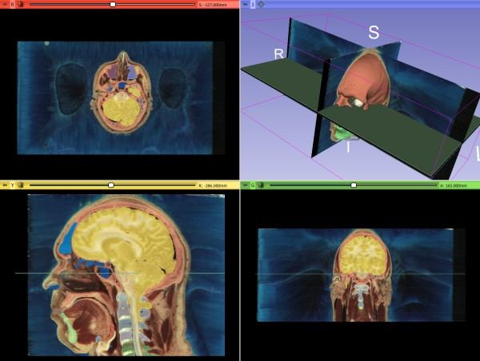
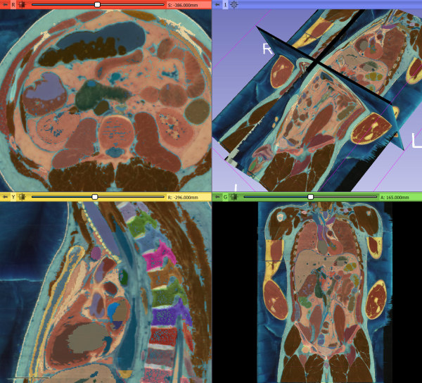

Back to [Projects List](../../README.md#ProjectsList)

# OpenAnatomy support in 3D Slicer

## Key Investigators

- [Andras Lasso](http://perk.cs.queensu.ca/users/lasso) (Queen's University, Canada)
- Michael Halle (Brigham and Women’s Hospital and Harvard Medical School)
- Steve Pieper (Isomics)

## Project Description

[OpenAnatomy](https://www.openanatomy.org/) is an initiative to change the anatomy atlas through open data, community-based collaborative development, and free distribution of medical knowledge. In the first phase of the project a few existing atlases were converted into a common format and made publicly accessible via a simple web application. The project is starting its next phase, which aims to design a storage format that is suitable for storing anatomical images, shapes, and descriptive information, and develop tools for viewing, creating, and editing these atlases.

3D Slicer supports importing, visualizing, and annotating medical images and export the resulting data in a variety of formats. Therefore, 3D Slicer could serve as a basis of an OpenAnatomy authoring tool.

OpenAnatomy project needs an authoring tool and 3D Slicer almost fulfills all the needs except specific import/export features and some improvements in data annotation capabilities.

## Objectives

Improve 3D Slicer’s existing features to support glTF file format export/import and allow defining hierarchies and standard terminology for segmented structures. Tasks are shared between experienced Slicer core developers and junior software developers, and directed by OpenAnatomy experts.

## Approach and Plan

1. Implement glTF exporter module that allows writing segmentations or model hierarchies as glTF files.
1. Test and optimize workflow based on converting and editing existing anatomical atlases.

## Progress and Next Steps

1. Evaluated multiple gltf toolkits. Found that tinygltf library seems to be small but capable enough to fulfill our needs.
1. Converted [Voxel-man](https://www.voxel-man.com/) models to Slicer segmentation object
  - VoxelMan abdominal atlas cannot be saved as segmentation (running out of memory). Potential solutions: 1. use advanced nrrd streamed reading/writing, 2. allow writing of non-overlapping regions into single labelmap. (or maybe allow defining groups that are non-overlapping)
  - It seems that some images are corrupted:
    - head/CT: frozenCT1005 .. frozenCT1013
    - head/labels: labels1125
  - Segmentation is not clear (e.g., there are many holes and fractured contours)
  - What to do with multi-value labels? Merge them or assign different names (add suffix)?

Segmentation developments needed to better support atlases (with hundreds of segments):
- Reduce memory need of saving (we cannot save segmentations with many labels)
- Many operations are very slow
- Segment search/filter option needed

## Illustrations

## Background and References

+ [Open Antomy Browser](https://www.openanatomy.org/)
+ [SlicerWeb glTF v1.0 exporter implementation](https://github.com/pieper/SlicerWeb/blob/0952659e38dd6b0a7511242235f3919ee7e09048/WebServer/WebServer.py#L37-L533)
