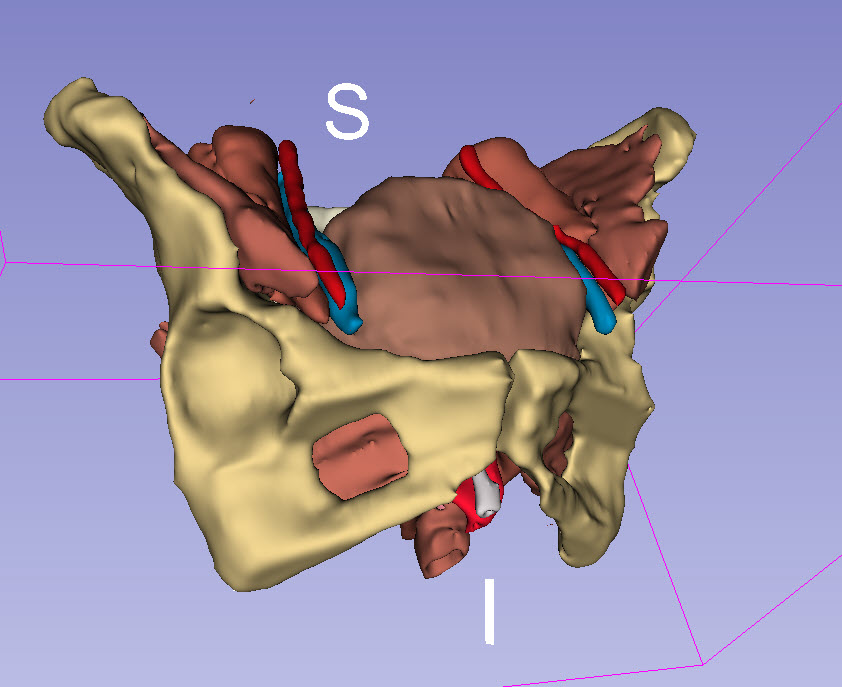

Back to [Projects List](../../README.md#ProjectsList)

# Segment Editor clinical workflows

## Key Investigators

- [Andras Lasso](http://perk.cs.queensu.ca/users/lasso) (Queen's University, Canada)
- [Scheherazade Kraß](http://www.mic.uni-bremen.de/cmt-management-team/scheherazade-kras/) (University of Bremen, Germany)
- Babacar Diao
- Ahmedou Moulaye Idriss
- (Anybody with questions and suggestions for image segmentation)

# Project Description

## Objective

* Segment Editor is the new manual and semi-automated image segmentation module in Slicer. It has powerful tools, but the learning curve can be steep for segmenting more complex cases.
* The objective is to help researchers aiming to use Segment Edtitor use it for their specific use cases, and augment the training material based on the results

## Approach and Plan

* Each participating researcher brings a dataset, for which we'll attempt to develop an effective segmentation workflow
* Add the developed workflows in the [Slicer Segmentation Recipes](https://github.com/lassoan/SlicerSegmentationRecipes) page
  * Publicly share dataset
  * Create a tutorial page for the segmentation case including screenshots

## Progress and Next Steps

* Liver Data-set (Scheherazade Kraß): Segmentation of lesion and vessels. Used for printing gel phantom for robotic intervention testing. Lesions are segmented using Grow from seeds and separated using Islands effect. Vessels segmented using global thresholding.
* Finger segmentation on MRI (Ahmedou Moulaye Idriss): for anatomical atlas purposes. Bones are OK to segment using Grow from seeds, but quite noisy, so maybe other effects could be as good or better. Vessel: contrast not very high, but there is local contrast - it can be tracked with a sphere brush with thresholding.
* Pelvic organ segmentation (Babacar Diao): Updates on how to use new segmentation features in Slicer-4.10.1.

# Illustrations

# Background and References

<!--Use this space for information that may help people better understand your project, like links to papers, source code, or data.-->

- [Segment Editor documentation](http://slicer.readthedocs.io/en/latest/user_guide/module_segmenteditor.html)
- [Segmentation training material on Slicer wiki](https://www.slicer.org/wiki/Documentation/Nightly/Training#Slicer4_Image_Segmentation)
- [Slicer Segmentation Recipes](https://github.com/lassoan/SlicerSegmentationRecipes)
