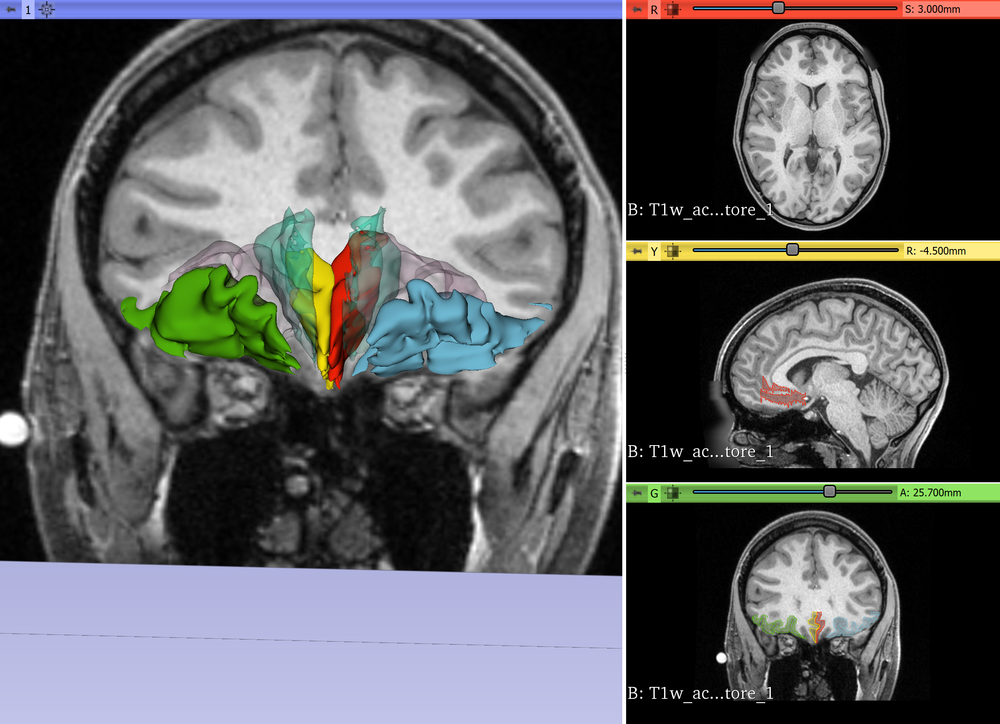
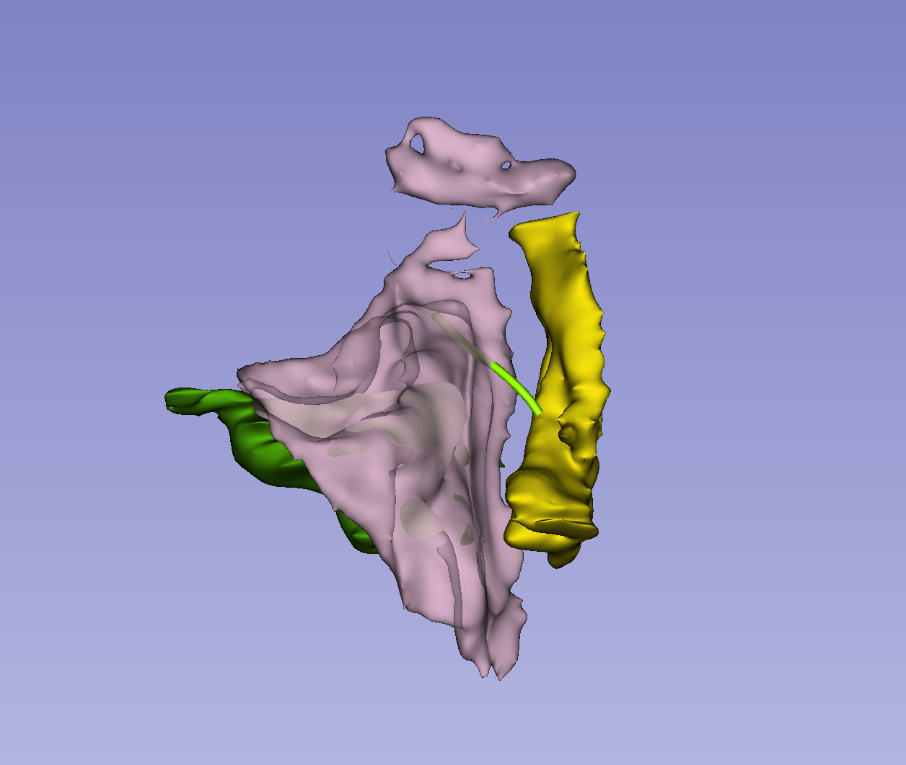

Back to [Projects List](../../README.md#ProjectsList)

# Quantitative Analysis of Human Orbitofrontal-subgenual Circuitry

## Key Investigators

- Nayra Pumar Carreras (ULPGC)
- Juan Ruiz-Alzola (ULPGC - GTMA - MACbioIDi)
- Juan Andres Ramirez Gonzalez (ULPGC)
- Peter Wilson-Braun (Massachusetts General Hospital)
- Senthil Palanivelu (Massachusetts General Hospital)
- Lipeng Ning (Brigham and Women’s Hospital)
- Yogesh Rathi (Brigham and Women’s Hospital)
- Jarrett Rushmore (Boston University)
- Nikos Makris (Massachusetts General Hospital)

# Project Description

The orbitofrontal-subgenual circuitry is important for the treatment of major depressive disorder (MDD) using non-invasive treatments in psychiatry, such as transcranial magnetic stimulation (TMS) or invasive neurosurgical approaches such as Deep Brain Stimulation (DBS). The anatomical structures involved in this circuitry are the orbitofrontal cortex, Brodmann’s area 11(BA 11), the Subcallosal area, BA 25 and the fiber tract that interconnects these two cortical areas, namely the frontopolar bundle. The two cortical areas of this circuitry can be targets for TMS procedures or DBS interventions.

## Objective

1. We will segment the orbitofrontal cortex and the subcallosal area using SLICER in the individual subject brain using T1 MRI data.
2. We will connect these two cortical regions using the tractographic white matter query language (WMQL) software on diffusion MRI data of the same subject.

## Approach and Plan
1.  Segment orbitofrontal cortex on T1w MRI
2.  Segment subcallosal area on T1w MRI
3.  Perform whole brain diffusion tractography on b3000 file
4.  Perform WMQL to isolate pathways between orbitofrontal region and subcallosal area.

## Progress and Next Steps
1.  Segmentation of orbitofrontal cortex and subcallosal area successfully performed on T1 data.
2.  Whole brain DMRI tractography successfully performed.
3.  Diffusion and Structural data registered.
4.  WMQL query performed.

# Illustrations

# Background and References
