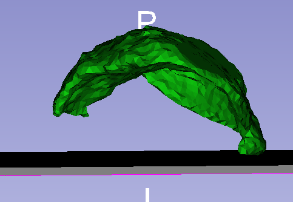
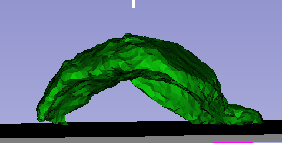

Back to [Projects List](../../README.md#ProjectsList)

# Interactive medical simulation toolkit (IMSTK) integration

## Key Investigators

- Samantha Horvath (Kitware)
- Andras Lasso (Queen's Universtity)
- Tina Kapur (Brigham and Women's)

# Project Description

For this project, we are working on integrating the Interactive Medical Simulation Toolkit (iMSTK) into a Slicer extension.

## Objective

Our goal for project week is to have a working extension that demos an iMSTK simulation

## Approach and Plan

1. Build iMSTK libraries through a superbuild extension
2. Create a loadable module that initializes an iMSTK simulation
3. Link that simulation inputs/outputs to Slicer
4. Display the progress of the simulation through Slicer

## Progress and Next Steps

1. iMSTK Superbuild extension:  90% functioning, some remaining issues wth tbb linking
2. CollisionSimulation Module: Can load two arbitrary volumetic meshes for a gravity based collision,  allows for setting key parameters through GUI
3. Initial work on connecting Slicer transforms to iMSTK devices
4. Next step:  finish CMake changes to allow building on factory
5. Next step: add a tool interaction demo

# Illustrations

Demo using data from the Placeta flattening project

Placenta before collision.

Placenta during collision.

# Background and References

<!-- If you developed any software, include link to the source code repository. If possible, also add links to sample data, and to any relevant publications. -->
[iMSTK Home Page](https://www.imstk.org)

[iMSTK Git Repository](https://gitlab.kitware.com/iMSTK/iMSTK)

[SlicerIMSTK Extension Repository](https://gitlab.kitware.com/iMSTK/slicerimstk)
