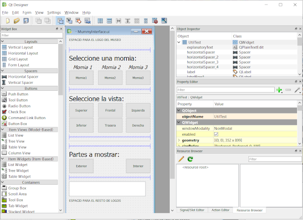
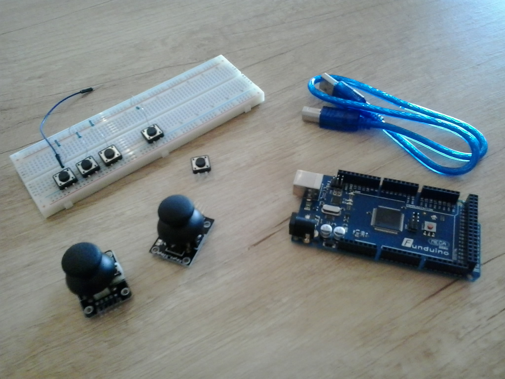

Back to [Projects List](../../README.md#ProjectsList)

# Customization of user interfaces for dissemination applications based on 3D Slicer

## Key Investigators

- Guillermo Valentín Socorro-Marrero (University of Las Palmas de Gran Canaria)
- Nayra Pumar Carreras (University of Las Palmas de Gran Canaria)
- José-Carlos Ruiz-Luque (Instituto de Astrofísica de Canarias)
- Abián Hernández-Guedes (University of Las Palmas de Gran Canaria)
- Juan Ruiz-Alzola (University of Las Palmas de Gran Canaria and Instituto de Astrofísica de Canarias)

# Project Description

<!-- Add a short paragraph describing the project. -->
This project aims at creating a minimal user interface oriented to museological environments. A 3D Slicer application will be implemented with the basic functionality and then its graphic user interface will be customized to a prescribed design. In addition, alternative input/output devices will be considered instead of the usual ones (keyboard, mouse and monitor). Therefore, we will work on the integration of hardware devices such as push buttons, a trackball, a gesture tracking device (Leap Motion), and a touch screen via serial communications. It is also intended to provide the system with 3D visualization capabilities using the SlicerVirtualReality extension.

## Objective

<!-- Describe here WHAT you would like to achieve (what you will have as end result). -->
1. Define a methodology to customize the graphical user interface of applications based on 3D Slicer
1. Combine 3D Slicer and PLUS facilities to integrate new input/output devices
1. Include 3D visualization capabilities.

## Approach and Plan

<!-- Describe here HOW you would like to achieve the objectives stated above. -->
1. Design a simple graphical user interface suitable for museological interfaces
1. Implement the prescribed interface using a Python scripted module
1. Integrate push buttons and a trackball connected to an Arduino-like platform in 3D Slicer using PLUS
1. Use SlicerVirtualReality extension to include visualization in virtual reality glasses
1. Integrate the Leap Motion.

## Progress and Next Steps

<!-- Update this section as you make progress, describing of what you have ACTUALLY DONE. If there are specific steps that you could not complete then you can describe them here, too. -->
<!-- Describe specific steps you **have actually done**. -->
1. Graphical adaptation of the interface: insertion of the museum logos, spanish translation of the interface and use of the museum corporate colors
1. ...

# Illustrations

<!-- Add pictures and links to videos that demonstrate what has been accomplished.

-->

Sketch of the interface.
 
   

Arduino board with push buttons and trackballs.
 
  

 
Interface prototype with translated texts and corporate image
 
   
 
Museum logo
 
  
 
Detail of the custom buttons
 
  
# Background and References

<!-- If you developed any software, include link to the source code repository. If possible, also add links to sample data, and to any relevant publications. -->
- [PLUS Generic serial device](http://perk-software.cs.queensu.ca/plus/doc/nightly/user/DeviceGenericSerial.html)
- [SlicerVirtualReality extension](http://github.com/KitwareMedical/SlicerVirtualReality)
- [Scripted modules](http://github.com/Slicer/Slicer/tree/master/Extensions/Testing/ScriptedLoadableExtensionTemplate/ScriptedLoadableModuleTemplate)
