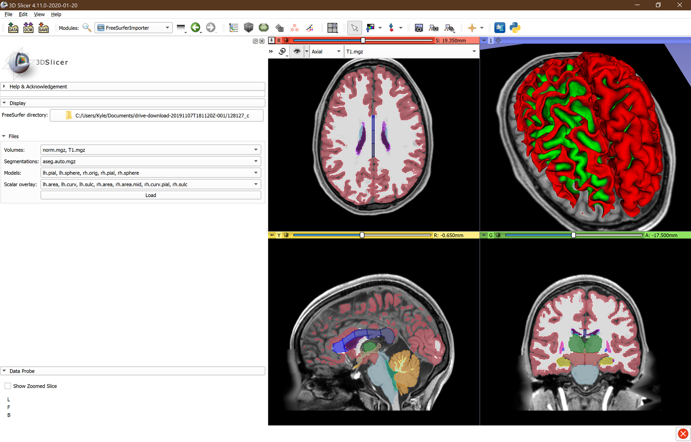

# Neuroanatomical Segmentation 2020

## Key Investigators

- Sylvain Bouix (BWH)
- Jarett Rushmore (Boston University, BWH)
- Kyle Sunderland (Queen's University)
- Nikos Makris (BWH, MGH)
- Andras Lasso (Queen's University)

# Project Description

1.  The objective of this project is to establish tools and techniques to produce a high resolution manual segmentation of the human brain.

## Objective

<!-- Describe here WHAT you would like to achieve (what you will have as end result). -->

1. Integrate Freesurfer file formats.  
    Freesurfer is a program used to generate brain surfaces from MRI data.  Freesurfer file formats use their own coordinate space and thus do not seamlessly integrate with the MRI files read by Slicer.  The objective is to make freesurfer file formats easily accessible within Slicer.
2. Sulcal Drawing
The use of 3D tools to draw and delimit brain sulci depends on freesurfer input (number 1) and an algorithm to draw on sulci and extract the lines in coordinate space.  The goal is to troubleshoot this process.
3. Case Management
    - Integration of a BIDS-based cased management system would aid organization and segmentation.
    - Version Control for segmentations

## Approach and Plan
<!-- Describe here HOW you would like to achieve the objectives stated above. -->
1. Freesurfer Integration
    - Load freesurfer surfaces into Slicer

1.  Sulcal Drawing
    - Using the white matter surfaces, draw two points in Slicer, each at the base of a sulcus
    - Connect the two points with a line at the bottom of the sulcus (i.e., a minimum value)
    - Assign the line to a specific sulcal identity.
    - Implement a constraint option for markups to force them to be on a surface (i.e. model node, segmentation, or another markup)
    - Curve markups can currently be resampled along model surfaces, however they do not trace through the sulci

1. Case Management
    - Pilot organization
    - Add Git PR management tools to Slicer module.
      - While editing, save and commit changes to local branch
      - Push changes to branch on Git
      - When completed, create PR for review
    - Segment diff tool
    - Review by interating through the slices and adding comments to a table
    - Keep last two segmentation versions (reviewer + author) for comparison.

## Progress and Next Steps

### Progress
1. Freesurfer Integration
    - Implemented an extension ([SlicerFreeSurferImporter](https://github.com/PerkLab/SlicerFreeSurferImporter)) that can import surfaces from FreeSurfer in the correct coordinate system)
    
1. Case Management
    - Create initial implementation of version control for segmentations [NeuroSegmentation](https://github.com/PerkLab/NeuroSegmentation)
    - Commit and push segmentations to a git repository from NeuroSegmentation UI
    - Scene saved in BIDS format, with only derivatives folder under version control

### Next Steps
1. Freesurfer Integration
    - Allow selection of image volume to use as reference for the FreeSurfer coordinate system
    - Submit extension to extensions index
    - Remove FreeSurfer classes from Slicer core
1. Case Management
    - Implement mechanisms for editing/reviewer feedback
    - Allow repository selection
    - Create pull requests when ready for review
    - Implement a module that can calculate and display diff between segments
1. Sulci Drawing
    - Adjust resampling parameters of curve markup to follow sulci using sulcal height scalar overlay from FreeSurfer

# Illustrations

# Background and References

https://github.com/PerkLab/SlicerFreeSurferImporter
