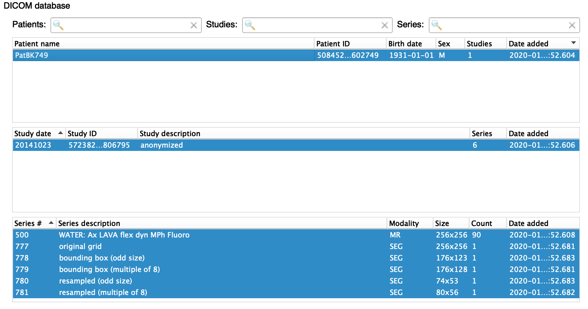
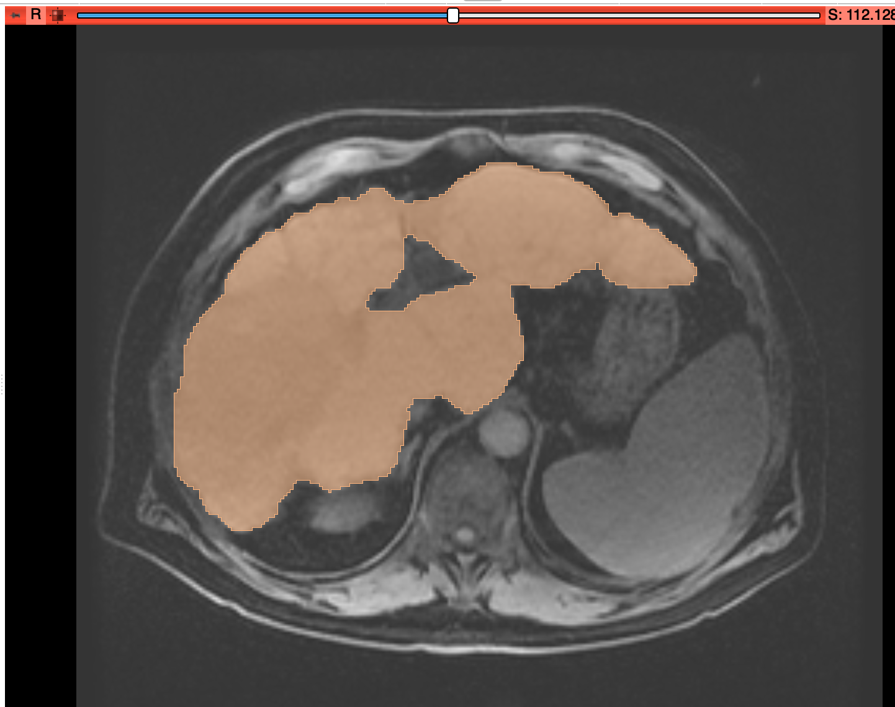

Back to [Projects List](../../README.md#ProjectsList)

# MEVIS Draw Tests & Interoperability

## Key Investigators

- Hans Meine
- Steve Pieper
- Erik Ziegler
- James Petts
- Marco Nolden

# Project Description

Fraunhofer MEVIS has recently released a standalone annotation tool called "MEVIS draw": https://s.fhg.de/mevisdraw

MEVIS draw contains a version of the "CSI" tool ("contouring with snapping and interpolation", while the *snapping* part is switched off in this application) that tries to provide an intuitive brush editor with nice interpolation features. It also supports a variety of import / export formats

## Objective

* Test MEVIS draw, compare with Slicer / OHIF tools
* Test interoperability w.r.t. import & export, e.g. in DICOM formats

## Approach and Plan

* Demo to interested people, collecting feedback & inspiring others
* Test export of segmentation results & import in Slicer

## Progress and Next Steps

* Tested inofficial macOS build on Hans' machine
  * found some tiny usability bug not present on other platforms
  * SEG export did not save any file :-(
* Tested on Windows by Steve
  * SEG export also failed on Windows
  * RTSTRUCT export exported two separate groups of contours as   different structions (should obviously be changed in MEVIS draw)
* Hans worked out a successful way of exporting SEG objects from MeVisLab
  * needs to be integrated in next versions of MEVIS draw
  * remaining problem with odd *height* of segmentation masks (odd widths were fixed previously, but height still seems to be a problem)
    * can be worked around by padding, though
  * import in Slicer worked only in nightly build (with improved DICOM database)
  * import in public MITK version did not work at all, but Marco could get it to run with a developer version

# Illustrations

