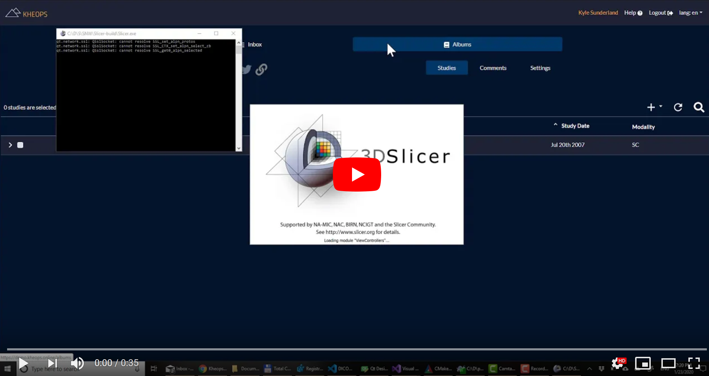

Back to [Projects List](../../README.md#ProjectsList)

# OHIF Slicer Bridge

## Key Investigators

- Steve Pieper (Isomics)
- [Andras Lasso](http://perk.cs.queensu.ca/users/lasso) (Queen's University, Canada)
- James Petts
- Mark Asselin
- Kyle Sunderland
- Csaba Pinter

## Project Description

Brainstorm and prototype synergies between the projects.

Possible scenarios:
* "Segmentation overdrive"
  * view studies with OHIF accessing dicomweb
  * perform annotation with OHIF
  * launch Slicer instance with same study loaded (transfer segmentation work-in-progress)
  * continue segmentation with Slicer Segment Editor
  * transfer results back to dicomweb server and continue review in OHIF
* Other use cases?
  
## Objectives

Define use cases and explore implementation options.

Possible implementation plan:
* use OHIF authenticated to google dicomweb
* add "overdrive" button
  * launches [containerized](https://github.com/pieper/SlicerDockers) slicer compute instance
  * passes in path to study, slocer downloads and loads the data ready to segment
  * opens new tab to slicer vnc
  * user can push segmentation results back to same study via dicomweb
  
List other requirements:
* reasonable performance launching and using cloud slicer for segmentation
* secured connection to Slicer
* lossless data transfer (especially about segmentation semantics)

## Approach and Plan

1. Discuss and document use cases (e.g. exposing Slicer modules as services instead of vnc)
1. Evaluate alternative implementations and requirements (running local, using aws, etc)
1. See what projects might take advantage of this capability

## Progress and Next Steps

1. Implemented downloading of DICOM data to local Slicer from browser using dicomweb

## Background and References

