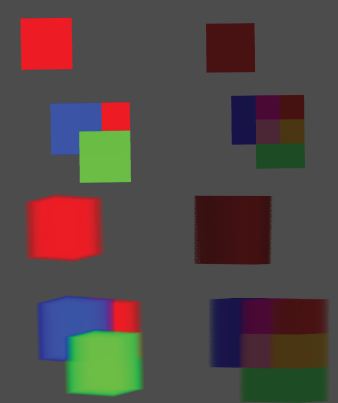

Back to [Projects List](../../README.md#ProjectsList)

# VTK.js Multi-volume Volume Rendering

## Key Investigators

- [Erik Ziegler][erik] ([Radical Imaging][radical])
- [Steve Pieper][steve] ([Isomics][isomics])
- [James A Petts][james] ([Radical Imaging][radical], [Ovela Solutions][OvelaSolutions])
- [Danny Brown][danny] ([Radical Imaging - Remote][radical])
- Ken Martin (Kitware - Remote)
- Jean-Christophe Fillion-Robin (Kitware)

## Description

The Open Health Imaging Foundation (OHIF) Viewer uses [VTK.js](https://github.com/Kitware/vtk-js) for multi-planar reformatting (MPR). We use thin-slice volume rendering to implement MPR in the OHIF Viewer. In order to support PET/CT image fusion with overlaid segmentation label maps, we need to implement multi-volume rendering in VTK.js. At present, multi-volume rendering sort of works but only for two volumes.

## Objective

Our goal is to add proper support for multi-volume volume rendering to VTK.js.

## Approach and Plan

<!-- Describe here HOW you would like to achieve the objectives stated above. -->

1. Evaluate how VTK C++ implements multi-volume rendering
2. Make similar changes to the VTK.js JavaScript / WebGL implementation
3. Clean up [terminology in VTK.js' RenderWindow](https://github.com/Kitware/vtk-js/pull/1264#issuecomment-561653542)

## Progress and Next Steps

* Held a preparation tcon with the Kitware team to review status and goals.
* We built a multi-volume mapper class which uses a dynamically created shader based on the number of volumes, and alpha blends across volumes along the ray.
* Next steps:
	* Fix clipping range computation from bounds around actors and test with real data
	* Fix alpha blending, opacity is not correct
	* Fix gradient opacity shading
	* Test / fix multi-component rendering per volume
	* Document all the variables and the approach
	* Stack opacity and color textures across volumes. This would allow us to get to 12 volumes instead of 4.

#### Plans from early meetings
Notes here: https://docs.google.com/document/d/1160z3fKJB6JfmT_EAlPRbqA5dD9B5iNfe08JctMUWOE/edit?usp=sharing

- Current VolumeMapper will remain in place, we will add a separate optional path that enables the MultiVolumeMapper class
- Targeting WebGL2 Only
- Colour and Opacity lookup tables for each volume will be stacked into 2D textures (num volumes * width of largest LUT)
- Since we include a jitter texture, this means we could have up to 13 volumes, since Chrome WebGL has a maximum of 16 textures.
- Blend Modes other than Composite (e.g. MIP) will not be available in the multi-volume VolumeMapper
- Labelmap outline rendering will not be available in the multi-volume VolumeMapper
- Sampling distance will be computed from the minimum sample distance across the provided volumes.
- Vertex shader will need to be provided a bounding box of the union of all volumes in space. For now it can use the entire canvas.
- Work in progress branch is here: https://github.com/Kitware/vtk-js/compare/master...swederik:multivolume

# Illustrations

#### Current state
This is what rendering two cubes currently looks like in VTK.js. It _should_ turn purple at the intersection of the cubes if they were both being sampled and mixed along each step of the ray.

### Work-in progress Multi-volume Renderer

# Background and References

<!-- If you developed any software, include link to the source code repository. If possible, also add links to sample data, and to any relevant publications. -->

* New free tutorials for VTK.js and OHIF: https://discourse.vtk.org/t/new-free-video-tutorials-vtk-js-and-ohif-web-apps/2164
* https://vtk.org/Wiki/VTK/ProgrammableMultiVolumeRendering
* https://github.com/Kitware/vtk-js
* https://github.com/Kitware/vtk-js/pull/1264

* https://github.com/pieper/step STEP multivolume rendering webgl2 examples
    * https://www.youtube.com/watch?v=8dputUoKBTA
    * https://www.youtube.com/watch?v=ML9_JWAz1kY
    * https://www.youtube.com/watch?v=_0K9vxgdwUU
* Previous project week experiments
    * https://projectweek.na-mic.org/PW28_2018_GranCanaria/Projects/MultiVolumeRendering/
<!--
    Links
-->

[radical]: http://radicalimaging.com/
[danny]: https://github.com/dannyrb
[isomics]: http://isomics.com/
[james]: https://github.com/jamesapetts
[OvelaSolutions]: https://www.ovelasolutions.com
[erik]: https://github.com/swederik
[steve]: https://github.com/pieper
[ohif-viewer]: https://github.com/OHIF/Viewers
[ohif-extensions]: https://docs.ohif.org/advanced/extensions.html
[ohif]: http://ohif.org/
