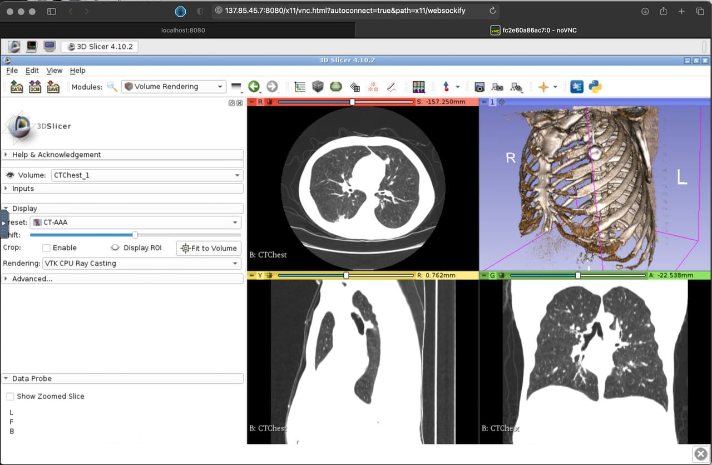
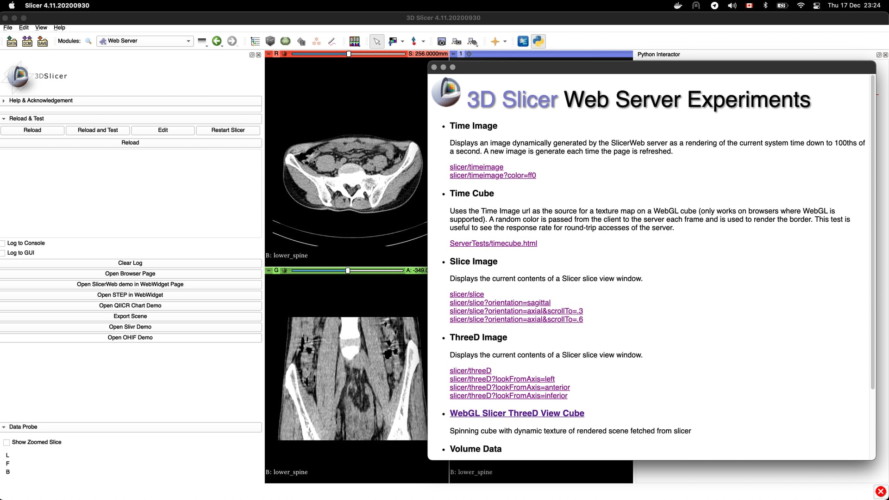
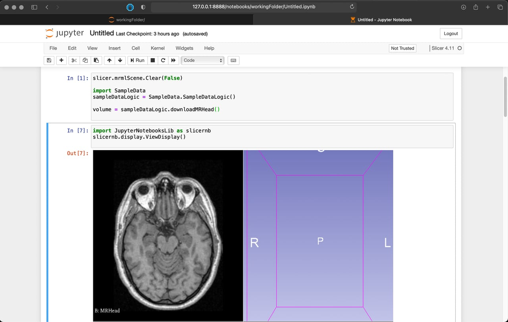

# Slicer in Cloud environments

## Key Investigators

- Steve Pieper
- Theodore Aptekarev

# Project Description

This project is aimed to provide an updated overview of existing techniques of using 3D Slicer over an internet connection.

## Objective

During this project week we would like to:

1. Categorize existing data regarding using slicer over the internet
2. Test and create/link a set of easy-to-use manuals/tutorials/boilerplates that explain basic setup options and use cases

## Approach and Plan

1. Collect, categorize and analyse forum posts that ask about using Slicer remotely.
2. Review existing techniques (Docker, Cloud VM, Slicer Notebooks, Browser-based web app, Headless usage).
3. Create a set of example manuals/tutorials/boilerplates that show basic setup options for some of the existing techniques.
4. Submit manuals for review and agree about featuring them in some place visible to relevant people.

## Progress and Next Steps

<!-- Update this section as you make progress, describing of what you have ACTUALLY DONE. If there are specific steps that you could not complete then you can describe them here, too. -->

After running a simple scrapper through the forum and collecting all articles that mention keywords such as “web”, “cloud”, “internet” and “remote” a list of  170 articles was filtered based on the criteria of being related to some sort of remote usage of Slicer and not simply mentioning “the cloud” in some context.

The chosen 170 articles were filtered based on relevance to cloud or other remote web-based environments. The resulting 63 forum posts were scanned for external links and their click count.

After analyzing the content and grouping the links tha data leads us to the 4 main approaches:

- **Slicer as a desktop app running on a remote computer with remote desktop access**

    For remote access to regular workstations VNC/RPD is used quite often. VNC connection errors appear in the forum topic sample quite frequently.

    For running Slicer on a machine rented form a Cloud provider the forum pointed to the following:

    | # |Technology| Description |
    |---|---|---|
    | 4 | [SlicerDockers](https://github.com/pieper/SlicerDockers) | A collection of docker containers with Various versions of Slicer |
    | 6 | [VirtualGL](https://virtualgl.org) | Techology behind noVNC that allows remote access to a Slicer machine via a web browser |
    | 11 | [SlicerGCPSetup](https://github.com/QIICR/SlicerGCPSetup) | Instructions on setting up Slicer on a virtual machine rented from Google |
    | 12 | [SlicerDocker](https://github.com/Slicer/SlicerDocker) | A collection of docker containers with Slicer and Slicer Notebook |

- **Slicer as a headless computation node running on a remote computer**

    The SlicerDockers container contains a simple proof of concept example to run a slicer based script in a docker instance.

    | # |Technology| Description |
    |---|---|---|
    | 4 | [SlicerDockers](https://github.com/pieper/SlicerDockers) | A collection of docker containers with Various versions of Slicer |
    | 5 | [Girder](https://github.com/girder/slicer_cli_web) | Slicer cli module for the Girder data management platform |
    | 7 | [SlicerWeb](https://github.com/pieper/SlicerWeb) | Slicer module that exposes a web server to support web services an applications. |

- **SlicerJupyter with a kernel running on a remote computer with TCP access**

    While using Slicer via a Jupyter notebook it is possible to access all the features of the application, render all existing UI elements, use ipywidgets to control parameters in Slicer and have remote interactive access to the application as a whole. See the Binder link to try this functionality online.
    Voilà being a part of Jupyter allows creation of simple dashboards.

    | # |Technology| Description |
    |---|---|---|
    | 1 | [SlicerJupyter](https://github.com/Slicer/SlicerJupyter) | A collection of instructions on setting up a Jupyter Notebook server inside Slicer locally and remotely. |
    | 3 | [Binder](https://mybinder.org/v2/gh/slicer/SlicerNotebooks) | A collection of notebooks for Binder demonstrating basic Slicer functionality. |
    | 8 | [Voilà](https://github.com/voila-dashboards/voila) | Dashboard creation toolkit for Jupyter ecosystem |
    | 13 | [Google Collab](https://github.com/googlecolab/jupyter_http_over_ws) | Google's notebook service |

- **Pure web re-implementation of the slicer UI**

    If the task is to streampline the existing UI for a single user, serving a Slicelet from a docker container is a viable solution. For many of the re-implementations of the Slicer UI - vtk.js is the technology that is used unter the hood.

    | # |Technology| Description |
    |---|---|---|
    | 2 | [Slicelets](https://www.slicer.org/wiki/Documentation/Nightly/Developers/Slicelets) | Documentation for creating simplified UI for specific workflows. |
    | 10 | [vtk.js](https://kitware.github.io/vtk-js) | Javascript port of the Visualization Tool Kit |
    | 15 | [dcmjs/vtkDisplay](https://github.com/dcmjs-org/dcmjs-examples/tree/master/vtkDisplay) | An example that demonstrates how to display a DICOM Segmentation object with vtk-js. |

    Apart from the technologies mentioned there are a lot of web-applications and toolkits that can be a starting point or an inspiration for re-implementing certain functionality of Slicer:

    | # |Technology| Description |
    |---|---|---|
    | 9 | [ParaView Glance](https://kitware.github.io/paraview-glance/) | Web version of Paraview |
    | 14 | [Universal Viewer](https://universalviewer.io/) | Web based 2D image viewer |
    | 16 | [Sphinx-Gallery](https://sphinx-gallery.github.io) | Web based image viewer and gallery |
    | 17 | [SliceDrop](http://slicedrop.com/) | Simple browser based image viewer |
    | -- | [OHIF](https://github.com/OHIF/Viewers/) | A zero-footprint medical image viewer |
    | -- | [Cornerstone.js](https://github.com/OHIF/Viewers/) | A zero-footprint medical image viewer |
    | -- | [Cornerstone.js](https://github.com/OHIF/Viewers/) | A zero-footprint medical image viewer |

    Cloud providers:

    | # |Technology| Description |
    |---|---|---|
    | 18 | [Jetstream](https://jetstream-cloud.org/) | HPC Cloud infrastructure provider |
    | 19 | [Microsoft Azure VMs](https://azure.microsoft.com/en-us/pricing/details/virtual-machines/windows/)| Cloud infrastructure provider |
    | 20 | [Google Cloud](https://cloud.google.com/iap/)| Cloud infrastructure provider |

---

To test different approaches a repository with docker-compose configuration files was created. It links to the projects mentioned above and makes launching sample containers as simple as running a single `docker-compose up` command.

[SlicerCompose repository](https://github.com/piiq/SlicerCompose)

# Illustrations

<!-- Add pictures and links to videos that demonstrate what has been accomplished.

-->

# Background and References

<!-- If you developed any software, include link to the source code repository. If possible, also add links to sample data, and to any relevant publications. -->

* Motivating Example: high resolution brain imaging data running on a cloud hosted GPU: https://youtu.be/oHZBFm02wbM
* Example of running docker in google cloud environment: https://youtu.be/WgiT5mCfG_w
* [SlicerDockers](https://github.com/pieper/SlicerDockers) can run in cloud machines with a container optimized OS on a VM or a regular OS with docker installed.  You can access the desktop by exposing the port or by tunneling the port through ssh.  [SlicerDocker](https://github.com/Slicer/SlicerDocker) should also work in this way.
* [https://github.com/pieper/SlicerMachines](https://github.com/pieper/SlicerMachines) is a system for generating bootable machine images that come pre-loaded with a GPU-backed Slicer and a desktop environment.
* [SlicerCompose](https://github.com/piiq/SlicerCompose) runs containers from SlicerDockers and SlicerJupyter using docker-compose configuration files