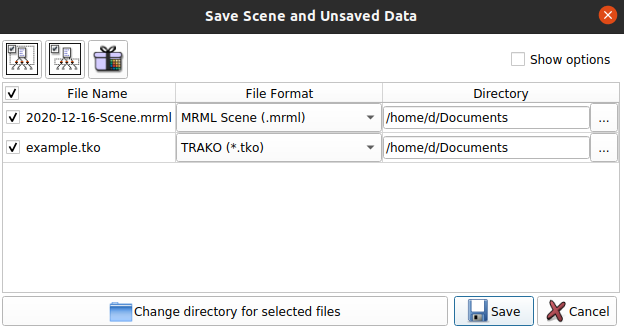

Back to [Projects List](../../README.md#ProjectsList)

# TRAKO Integration to 3D Slicer

## Key Investigators

- Daniel Haehn (University of Massachusetts Boston)
- Steve Pieper (Isomics)
- Lauren O'Donnell, Yogesh Rathi (BWH)

# Project Description

TRAKO is a new file format that stores streamlines and associated per-vertex and per-fiber data as glTF containers with compression. We will investigate how to best integrate TRAKO with 3D Slicer.

## Objective

<!-- Describe here WHAT you would like to achieve (what you will have as end result). -->

We want to make it possible to read and write TRAKO (.TKO) files using 3D Slicer.

## Approach and Plan

<!-- Describe here HOW you would like to achieve the objectives stated above. -->

1. Start with the pip-installable `trako` package to make an importer and exporter
1. Integrate TRAKO with the MRML scene architecture.
1. Consider architecture and options for a C++ implementation

## Progress and Next Steps

<!-- Update this section as you make progress, describing of what you have ACTUALLY DONE. If there are specific steps that you could not complete then you can describe them here, too. -->

1. We created ScriptedModule for SlicerDMRI (pull request open) that allows loading and saving of .TKO files.
1. We had to modify some things on Trako's side to make this work and cut a new release 0.3.5.dev9.
1. Steps required so far to make it work: 1) build Slicer + SlicerDMRI w/ pull request #145, and then 2) pip_install('trako') in the slicer
1. We now need JC's TrakoDracoPy wheels for all platforms and then update the SlicerDMRI extension to tie everything together.
1. Prototype implementation: https://github.com/pieper/SlicerDMRI/commit/1cfcbbc61d58588021de7a2e1ad8aafbf53274c1

# Illustrations

# Background and References

<!-- If you developed any software, include link to the source code repository. If possible, also add links to sample data, and to any relevant publications. -->

TRAKO repository: https://github.com/bostongfx/trako
