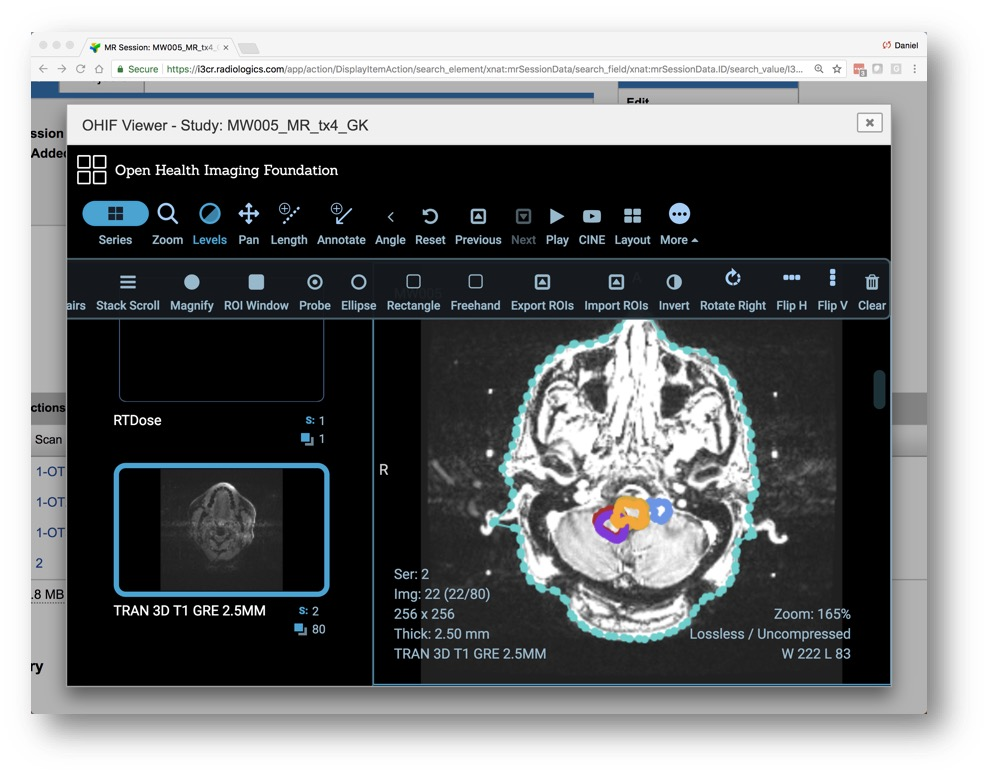
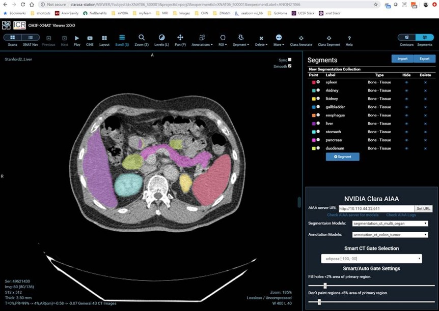

Back to [Projects List](../../README.md#ProjectsList)

# XNAT: OHIF 2.0 and annotation workflows

## Key Investigators

- Dan Marcus (Washington University)
- Kate Alpert (Radiologics)
- Tim Olsen (Radiologics)

# Project Description

<!-- Add a short paragraph describing the project. -->
XNAT 1.8 will be released December 21 with an upgraded viewer built on OHIF 2.0 (woohoo!). There's still plenty of room for improvement, in particular to support more complex image annotation workflows.

## Objective

<!-- Describe here WHAT you would like to achieve (what you will have as end result). -->

1. Identify and implement performance improvements, particularly in transferring content between XNAT and the viewer.
1. Identify and implement format for capturing broader range of image annotations.
1. Identify and implement storage of image annotations in XNAT.

## Approach and Plan

<!-- Describe here HOW you would like to achieve the objectives stated above. -->

1. Performance improvements: Transfer DICOM series as a single request.
1. Minimize hard coded views: Implement “hanging protocol”. Any bright ideas?
1. Uniform storage of image annotations: Any bright ideas? Must support contours, segments, lines, boxes, text, templatized reports.

## Progress and Next Steps

<!-- Update this section as you make progress, describing of what you have ACTUALLY DONE. If there are specific steps that you could not complete then you can describe them here, too. -->

1. TBD
1. ...
1. ...

# Illustrations

# Background and References

<!-- If you developed any software, include link to the source code repository. If possible, also add links to sample data, and to any relevant publications. -->
