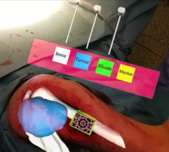
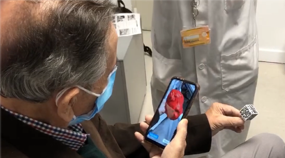

Back to [Projects List](../../README.md#ProjectsList)

# AR in Slicer

## Key Investigators

- Alicia Pose Díez de la Lastra (Universidad Carlos III de Madrid, Madrid, Spain)
- Javier Pascau (Universidad Carlos III de Madrid, Madrid, Spain)
- Csaba Pinter (Ebatinca S.L., Las Palmas de Gran Canaria, Spain)
- Lucas Gandel (Kitware, France)
- Adam Rankin (Robarts Research Institute / Western University, Canada)
- Jean-Christophe Fillion-Robin (Kitware, USA)
- Mónica García-Sevilla (Universidad de Las Palmas de Gran Canaria , Gran Canaria , Spain)
- Houssem Gueziri

# Project Description

<!-- Add a short paragraph describing the project. -->
Augmented Reality has increase its adoption in many areas with exciting benefits. Universidad Carlos III de Madrid (Madrid, Spain) has already worked in several medical projects
based on AR (see their progress in https://biig-igt.uc3m.es/augmented-reality/). On these studies, they usually export information from Slicer to an alternative software (Unity). 

The ultimate goal of this project is to check if it is possible to incorporate this technology directly to 3D Slicer in order to centralize the working process, at the time 
of benefiting from all Slicer tools.

## Objective

<!-- Describe here WHAT you would like to achieve (what you will have as end result). -->

1. Learn what can be done in AR using 3D Slicer.
2. Explore possible paths to integrate AR in 3D Slicer in the future.
3. Study if we can receive transformations in Unity from Slicer, so that we can transfer navigation information between the two softwares.

## Approach and Plan

<!-- Describe here HOW you would like to achieve the objectives stated above. -->

1. Develop a new Slicer extension called SlicerAR that streams AR directly to HoloLens 2.

## Progress and Next Steps

<!-- Update this section as you make progress, describing of what you have ACTUALLY DONE. If there are specific steps that you could not complete then you can describe them here, too. -->

1. AR Support (OpenXR) in VTK:

The WIP branch supporting Holographic remoting to stream VTK rendering inside the Hololens has been submitted [here](https://gitlab.kitware.com/vtk/vtk/-/merge_requests/8101).
The immediate actions to take are listed there in the TODOS section: 1. and 2. should be addressed to reuse this work in SlicerVR.

2. Alicia and Lucas tried to replicate in Alicia's computer the steps of the WIP branch Lucas' shared above. They summarized them in [this](StepsToFollow.pdf) pdf document. Despite they were not able to complete the final step, they found out and fixed many new issues that improved the project.

3. Alicia, Houssem and Étienne Léger also met to discuss some features related to pattern recognition in HoloLens with Vuforia and ArUco, latency and interconnectivity between Slicer and Unity.

# Illustrations

<!-- Add pictures and links to videos that demonstrate what has been accomplished.

-->
Here below you can find some AR implementations in health by Universidad Carlos III de Madrid (Madrid, Spain) in the past years:

HoloLens 2 in Orthopedic Oncological Surgeries:

Smartphone app to communicate with the patient and help him/her understand his/her condition:

Real-time guidance during Open Cranial Vault Remodeling using smartphone:

Needle Insertion Guidance for Sacral Nerve Stimulation using smartphone:

# Background and References

<!-- If you developed any software, include link to the source code repository. If possible, also add links to sample data, and to any relevant publications. -->
