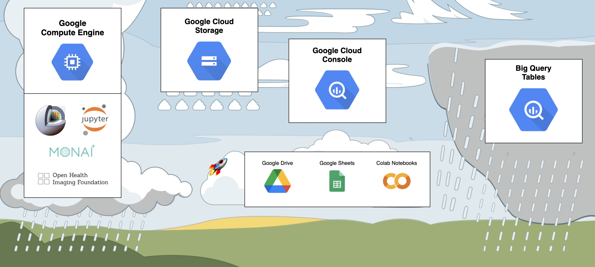
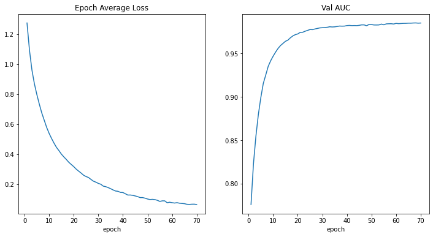

Back to [Projects List](../../README.md#ProjectsList)

# NCI Imaging Data Commons

## Key Investigators (subject to change)

- Andrey Fedorov (Brigham and Women's Hospital, Boston)
- Markus Herrmann (Mass General Hospital, Boston)
- Theodore Aptekarev (Independent)
- Steve Pieper (Isomics Inc)
- Ron Kikinis (Brigham and Women's Hospital, Boston)

Special thanks to Fernando Pérez-García (UCL/KCL) for explaining PyTorch conventions and tensor permutations.

# Project Description

**WE ARE HIRING - see [job opportunities here](https://spl.harvard.edu/join-us) if interested!**

### National Cancer Institute (NCI) Imaging Data Commons

NCI IDC is a new component of the Cancer Research Data Commons (CRDC). The goal of IDC is to enable a broad spectrum of cancer researchers, with and without imaging expertise, to easily access and explore the value of de-identified imaging data and to support integrated analyses with non-imaging data. IDC maintains cancer imaging data collections in Google Cloud Platform, and is developing tools and examples to support cloud-based analysis of imaging data.

Some examples of what you can do with IDC:

* quickly explore the available public cancer imaging datasets using rich metadata, visualize images and annotations, build cohorts of relevant subsets of the data
* retrieve DICOM files corresponding to the selected cohort to a cloud-based Virtual Machine (VM)

In this project we would like to interact with the project week participants to answer their questions about IDC and understand their needs, collect feedback and suggestions for the functionality users would like to see in IDC, and help users get started with the platform.

Free cloud credits are available to support the use of IDC for cancer imaging research.

### GBM series tagging Project Week experiment

Broad motivation for the experiment is to enrich IDC data offering by improving the richness of metadata accompanying IDC content.

An experiment that can be completed within the Project Week can implement tool for tagging of the individual series within an MRI exam with the series type. The experiment will follow the catigorization of individual series that was proposed in [Advancing The Cancer Genome Atlas glioma MRI collections with expert segmentation labels and radiomic features](https://www.nature.com/articles/sdata2017117).

It is a valuable capability currently missing to allow for automatic tagging of individual series within a DICOM study, which is important for feeding data into the subsequent analysis steps.

The idea for the experiment is to develop a tool allowing to tag individual series, using, as needed, DICOM metadata and content of the image, utilizing the metadata table of the mentioned paper as a source of inspiration if not training/testing.

An additional and probably key feature of this experiment is that it's cloud native. This means that all resources and data does not leave the cloud datacenter. This is expected to bring insights on efficient workign setups that utilize the cloud infrastructure and provide an update on what's the barrier for entry to perform research on cloud resoures.
<!-- Add a short paragraph describing the project. -->

## Objective

<!-- Describe here WHAT you would like to achieve (what you will have as end result). -->

### NCI IDC

1. Provide attendees with the opportunity to interact with the platform developers to answer questions.
2. Collect use cases and suggestions

### GBM series tagging experiment

1. Create a cloud native workflow for training ML models on IDC data
2. Produce a trained model for tagging of the individual series within an MRI exam with the series type.

## Approach and Plan

<!-- Describe here HOW you would like to achieve the objectives stated above. -->

### NCI IDC
1. Work on more examples how to work with IDC.
2. Work on tools to streamline preparation of data for analysis.

### GBM series tagging experiment

1. Explore the data overlap between the TCIA-GBM data used in the paper and the data in IDC
2. Produce a training dataset to be used with a 2d classifier
3. Try out MONAI to train a 2d classifier

## Progress and Next Steps

<!-- Update this section as you make progress, describing of what you have ACTUALLY DONE. If there are specific steps that you could not complete then you can describe them here, too. -->

### NCI IDC

Visit "IDC-Bot" stream set up by Theodore under the discord project channel to watch short demo videos about IDC.

### GBM series tagging experiment

#### Setting up

The only setup requirement for utilizing the power of IDC is a Google Cloud account. This account has to be setup only once and if the user already uses or in the past used Google Cloud products - everything is in place.

Keep in mind that Google provides [free credits to new users](https://console.cloud.google.com/freetrial) and IDC does the same for existing users ([fill in the form here](https://learn.canceridc.dev/introduction/requesting-gcp-cloud-credits)).



This experiment utilized the following APIs:

- ***Big Query.*** IDC stores the metadata extracted from all DICOM images in Big Query Tables. The [cloud console](https://console.cloud.google.com/bigquery?) provides an interface to develop queries that provides a very pleasant user experience.
- ***Cloud Storage.*** IDC stores DICOM files in a Cloud Storage Bucket. Additionally a bucket is used to store intermediate results.
- ***Colab Notebooks.*** The most basic free version of the Colab Notebooks is really sufficient to run this experiment. The free GPUs that you can attach to the notebook is enough to drastically speed up the training process.

In real life you would probably want to add the following APIs to the mentioned ones:

- ***AI Notebooks.*** Managed virtual machines with full Jupyter Lab environment.
- ***Compute Engine.*** Virtual Machines infrastructure for any purpose. With GCE you can create custom VMs that will run cloud instances of many of the popular applications, including Slicer, Jupyter Lab, MONAI Label, OHIF-Viewer etc.

### The Experiment


The experiment utilized the free tools provided by Google to all it's users to see if such research can be contucted without the cloud infrastructure "heavy-lifting". The main computation platform was the free version of the Colab Notebooks that were stored in a Google Drive folder.

All the notebooks created for this experiment are available in the [Github repository](https://github.com/piiq/pw35-gbm-tagging). Run them in Google Colab now:

<a href="https://colab.research.google.com/github/piiq/pw35-gbm-tagging/blob/main/001_IDC_&_ReferenceData_Exploration.ipynb" target="_parent\"> 001\_IDC\_&\_ReferenceData\_Exploration.ipynb</a>

<a href="https://colab.research.google.com/github/piiq/pw35-gbm-tagging/blob/main/002_Data_Sampling.ipynb" target="_parent\"> 002\_Data\_Sampling.ipynb</a>

<a href="https://colab.research.google.com/github/piiq/pw35-gbm-tagging/blob/main/003_Pre_process_Data.ipynb" target="_parent\"> 003\_Pre\_process\_Data.ipynb</a>

<a href="https://colab.research.google.com/github/piiq/pw35-gbm-tagging/blob/main/004_Classifier_Training.ipynb" target="_parent\"> 004\_Classifier\_Training.ipynb</a>


By default Colab provides instances with 2 cores and 12 GB of RAM. With an additional GPU that you can attach to the notebook this is enough for most of the tasks. For comparison analysis the preprocessing was also done on a 12 core 32 GB RAM instance to see if additional multiprocessing can boost performance.

The use of a dedicated VM can boost performance if the scripts enable multiprocessing for computation. Additionally firing up multiple instances of the `gsutil` commands can speed up data transfer. For example, during the experiment the command

```bash
cat "$TARGET_CLASS"_gcs_paths.txt | gsutil -u "$MY_PROJECT_ID" -m cp -I ./data/"$TARGET_CLASS"
```

was executed in 4 different screen sessions simultaneously to test the download speed. The results were 16 MBps when there is only one `gsutil` command running and 8 MBps if there are 4 `gsutil` commands running.

### Results and conclusions

1. As expected the DenseNet showed good results in training with zero configuration.



2. The barier for entering cloud computing lowered significantly with wider adoption of the GPU-enabled Colab notebooks.

# Illustrations

* [IDC Portal](https://imaging.datacommons.cancer.gov/) can be used to explore the data available in IDC and buid and save cohorts 
* See any of the studies from IDC collections in IDC Viewer, build Viewer URL by referencing DICOM UIDs, e.g., https://viewer.imaging.datacommons.cancer.gov/viewer/1.3.6.1.4.1.32722.99.99.239341353911714368772597187099978969331 
* Search all of the DICOM metadata from IDC collections using SQL or DataStudio (as in [this template](https://datastudio.google.com/reporting/ab96379c-e134-414f-8996-188e678f1b70/page/KHtxB/preview)) 
* Access DICOM files defined as IDC cohort or as an SQL query from IDC collections from Google Colab notebook or VM with the following steps (you can get free GCP credits from IDC, which will give you the GCP project ID to use in the commands below) - from example Colab notebook [here](https://github.com/ImagingDataCommons/IDC-Examples/blob/master/notebooks/Cohort_download.ipynb):
```
# authenticate with Google
from google.colab import auth
auth.authenticate_user()

# retrieve the cohort content run a direct SQL query against IDC DICOM metadata table
%%bigquery --project=$<my_GCP_project_ID> cohort_df

SELECT * 
FROM `<my_cohort_BQ_table>`

# save the manifest as text file on the VM:
cohort_df = cohort_df.join(cohort_df["gcs_url"].str.split('#', 1, expand=True).rename(columns={0:'gcs_url_no_revision', 1:'gcs_revision'}))
cohort_df["gcs_url_no_revision"].to_csv("gcs_paths.txt", header=False, index=False)

# retrieve the DICOM files corresponding to the cohort manifest
!mkdir downloaded_cohort
!cat gcs_paths.txt | gsutil -u <my_GCP_project_ID> -m cp -I ./downloaded_cohort
```

# Background and References

* [IDC Portal](https://imaging.datacommons.cancer.gov/)
* [short paper](https://cancerres.aacrjournals.org/content/early/2021/06/15/0008-5472.CAN-21-0950) accompanied by [videos](https://cancerres.aacrjournals.org/content/early/2021/06/21/0008-5472.CAN-21-0950.figures-only) with the summary of what IDC aspires to accomplish
