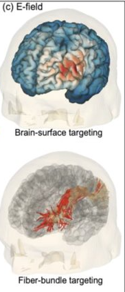

Back to [Projects List](../../README.md#ProjectsList)

# Real-time visualization and precision targeting in transcranial magnetic stimulation (TMS)

## Key Investigators

- Loraine Franke (University of Massachusetts Boston)
- Lipeng Ning (BWH & Harvard Medical School)
- Daniel Haehn (University of Massachusetts Boston)
- Yogesh Rathi (BWH & Harvard Medical School)
- Steve Pieper (Isomics, Inc.)

# Project Description

Transcranial magnetic stimulation is an nonivasive procedure used for treating depression with magnetic and electric fields to stimulate nerve cells. A TMS coil is slowly moved over the subject's head suface to target certain areas in the brain. 
Our project aims to develop a deep-learning powered software for real-time E-Field prediction and visualization within 3D Slicer.

## Objective

Real-time visualization of an electric field (E-field) for transcranial magnetic stimulation (TMS) on the brain surface as well as visualizing the E-field along fiber bundles (DTI) and later the possibility to optimize the coil position or to target certain fibers.

## Approach and Plan

Integrate the visualization process as a new module within the MRML scene architecture:

- Evaluate different methods to visualize the e-field on the surface mesh (find fastest method which is appropriate for a real-time visualization)
- Add rendering of a TMS coil model to the module in 3D Slicer
- Develop an approach to move/rotate the coil model over the brain surface in 3D Slicer

## Progress and Next Steps

<!-- Update this section as you make progress, describing of what you have ACTUALLY DONE. If there are specific steps that you could not complete then you can describe them here, too. -->
- coming soon ...

# Background and References
