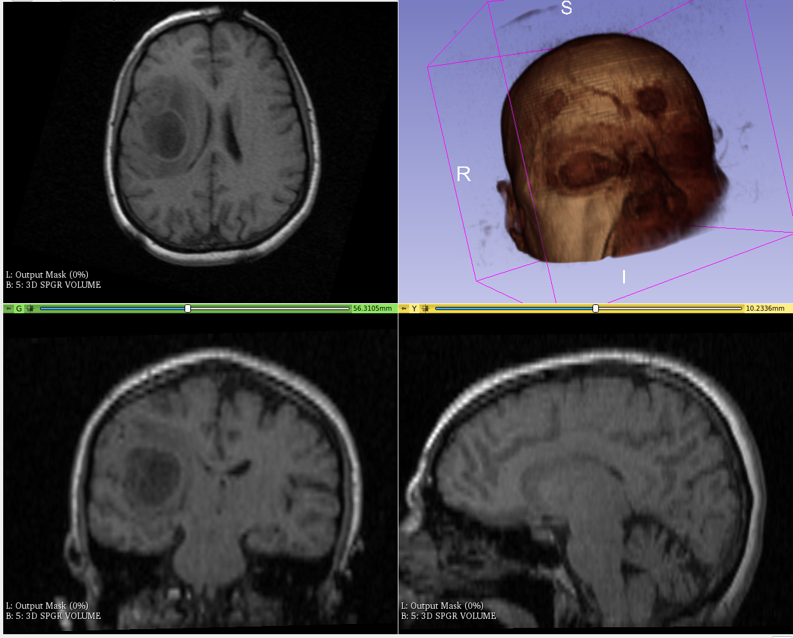

# Skin Segmentation on MR

## Key Investigators

- Reuben Dorent (King's College London, UK)
- Tina Kapur (Brigham and Women's Hospital, USA)
- Sarah Frisken (Brigham and Women's Hospital, USA)
- Mohammad Jafari (Brigham and Women's Hospital, USA)
- Samantha Horvath (Kitware)
- Jean-Christophe Fillion-Robin (Kitware)
- Harneet Cheema (Brigham and Women's Hospital, USA)
- Fryderyk Kögl (BWH, TUM)

# Project Description
Neuronavigation systems allow for visualization of pre-operative images and planning information to estimate the precise location of target surgical areas. Patient-to-image mapping is a key step in the workflow of these neuronavigation systems. Registration approaches typically rely on landmarks on pre-operative images as well as on the patient in the operating room (OR) [1]. An alternative approach would be to directly map the patient's skin surface [2]. While extracting the skin surface of the patient in the OR can be performed using existing technologies (e.g., a pointer, a laser) [3], automatic skin surface extraction on scans remains an open problem. This project aims at developing an automated skin segmentation tool for pre-operative scans (T1w scans).

## Objective

<!-- Describe here WHAT you would like to achieve (what you will have as end result). -->

1. Create a database with manual annotations of the skin on T1w scans.
2. Develop a basic deep learning approach to perform skin segmentation.
3. Integrate the framework in Slicer.

## Approach and Plan

<!-- Describe here HOW you would like to achieve the objectives stated above. -->

1. Select an MR database and curate the data.
2. Define the annotation protocol.
3. Annotate the scans.
4. Train a deep learning approach.
5. Assess the performance of the proposed model.
6. Develop a Slicer module with the pre-trained model.

## Progress and Next Steps

<!-- Update this section as you make progress, describing of what you have ACTUALLY DONE. If there are specific steps that you could not complete then you can describe them here, too. -->

1. Currently selecting the MR database.

# Illustrations

<!-- Add pictures and links to videos that demonstrate what has been accomplished.

-->

# Background and References

<!-- If you developed any software, include link to the source code repository. If possible, also add links to sample data, and to any relevant publications. -->
1. Gerard, Ian J et al. “New Protocol for Skin Landmark Registration in Image-Guided Neurosurgery: Technical Note.” Neurosurgery vol. 11 Suppl 3 (2015): 376-80; discussion 380-1. doi:10.1227/NEU.0000000000000868
2. Shamir, R. R., Freiman, M., Joskowicz, L., Spektor, S., & Shoshan, Y. (2009). Surface-based facial scan registration in neuronavigation procedures: a clinical study, Journal of Neurosurgery JNS, 111(6), 1201-1206. Retrieved Jan 3, 2022, [Link](https://thejns.org/view/journals/j-neurosurg/111/6/article-p1201.xml)
3. [BrainLab Softouch®](https://www.equiphos.com/wp-content/uploads/2015/05/Flyer-Softtouch-regiitration.pdf)
