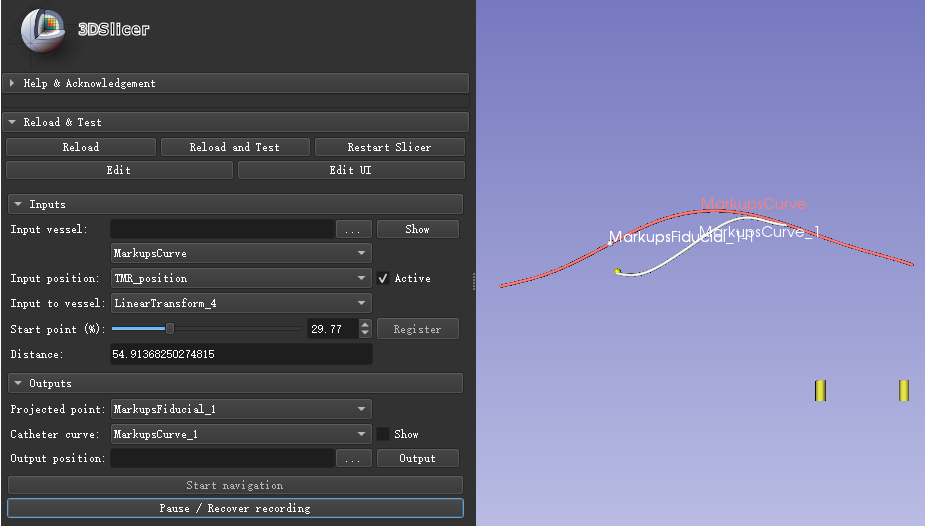

Back to [Projects List](../../README.md#ProjectsList)

# Catheter Navigation for Slicer

## Key Investigators

- Wenran Cai (University of Tokyo)
- Kazuaki Hara (University of Tokyo)
- Rina Nagano (University of Tokyo)
- Junichi Tokuda (Brigham and Women's Hospital)

# Project Description

<!-- Add a short paragraph describing the project. -->

Intra-arterial chemotherapy requires knowing the position of the catheter tip in the body in order to insert the catheter accurately. Currently, the position is confirmed by X-ray irradiation during the operation. To reduce exposure and contrast agents, it is necessary to apply a new method to track the catheter tip. Electromagnetic tracking system with a TMR (Tunnel Magnetoresistance) sensor is helpful to track the catheter movement. Here, we developed an extension of 3D Slicer to connect 3D Slicer and our TMR tracking system.

## Objective

<!-- Describe here WHAT you would like to achieve (what you will have as end result). -->

1. Create an extension that can show catheter path from an electromagnetic tracking with TMR sensors in real time.

## Approach and Plan

<!-- Describe here HOW you would like to achieve the objectives stated above. -->

A vessel model will be reconstructed from a preoperative 3D CT. During the operation, real-time data from the sensor is imported into 3D Slicer via OpenIGTLink. A first version is already done.

## Progress and Next Steps

<!-- Update this section as you make progress, describing of what you have ACTUALLY DONE. If there are specific steps that you could not complete then you can describe them here, too. -->

1. Use multiprocessing method to improve realtime performance. (Problem: Third party library “dill” in Python cannot work properly in 3D Slicer.)

# Illustrations

<!-- Add pictures and links to videos that demonstrate what has been accomplished.

-->

# Background and References

<!-- If you developed any software, include link to the source code repository. If possible, also add links to sample data, and to any relevant publications. -->

1. R.Nagano, etal. CARS 2021: Development of an electromagnetic catheter tracking system using TMR sensor for superselective intraarterial chemotherapy, 2021. Int J CARS 16, 1–119 (2021).
