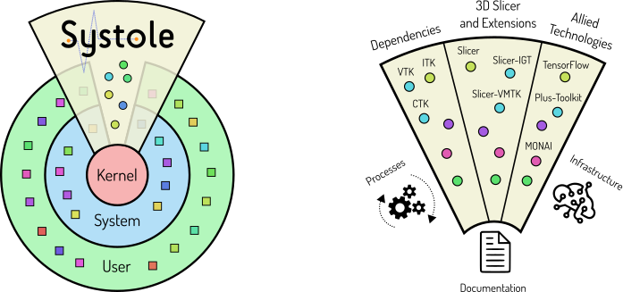

Back to [Projects List](../../README.md#ProjectsList)

# Systole OS: an operating system for development/deployment of medical devices.

## Key Investigators

- Rafael Palomar

# Project Description

<!-- Add a short paragraph describing the project. -->

For more than a decade, 3D Slicer has been enabling world-class biomedical
research. The great success of 3D Slicer is now pushing the boundaries of
research, making some research groups and companies regard 3D Slicer as a viable
software for building medical devices that not only could support regular
clinical workflows but also become commercial products. While the development of
3D Slicer has been tailored towards reaching a wide variety of researchers
(e.g., multiple platforms, environment isolation, extension manager, etc.) its
modular architecture makes possible the development of custom applications.

The vision of Systole OS is the integration of 3D Slicer and related software (e.g,
Plus Toolkit, MONAI Label and more!) in a free and open-source operating system
based on GNU/Linux, with the aim to support the development and deployment of
medical devices. 

Here are some of the features that we would like to leverage in
Systole OS:

### Cutting-edge software
  
Systole OS is based on Gentoo Linux, which follows a rolling-release model
providing up-to-date support out of box.

### Installable Slicer...

Slicer, together with all the required dependencies will be installable with a simple
command (e.g., `emerge sci-medical/slicer`). No SuperBuild! No Slicer-Launcher!

### ...and Modular Slicer

The base installation of 3D Slicer will include only the components needed to
run the application (e.g., `emerge slicer-modules/models` can be done
separately).

### Source-based

Systole OS is a **source-based** distribution, which means that all packages
will be built from source. Having the flexibility to make decisions on
compile-time allows:

   - Tighter hardware integration
   - Highly configurable packages (e.g., `flaggie sci-medical/slicer -python +opencl; emerge sci-libs/slicer` will install Slicer without python support and with opencl support)
   - Portability to hardware architectures other than amd64 (e.g., arm, risc-v).

### Extensible

Systole OS works on the Gentoo overlay system which allows you to extend the
system with your own ovelay or override packages provided by Systole.

## Objective

In PW37 we aim to create the Systole overlay, which is a set of packages
containing an installable version of 3D Slicer and its dependences.

## Approach and Plan

1. Review of dependencies and `-DSUPERBUILD=OFF`
1. Development of the packages for the dependencies and 3D Slicer
1. Development of the packages for the 3D Slicer default modules

## Progress and Next Steps

<!-- Update this section as you make progress, describing of what you have ACTUALLY DONE. If there are specific steps that you could not complete then you can describe them here, too. -->

# Illustrations

<!-- Add pictures and links to videos that demonstrate what has been accomplished.

-->

# Background and References

<!-- If you developed any software, include link to the source code repository. If possible, also add links to sample data, and to any relevant publications. -->

