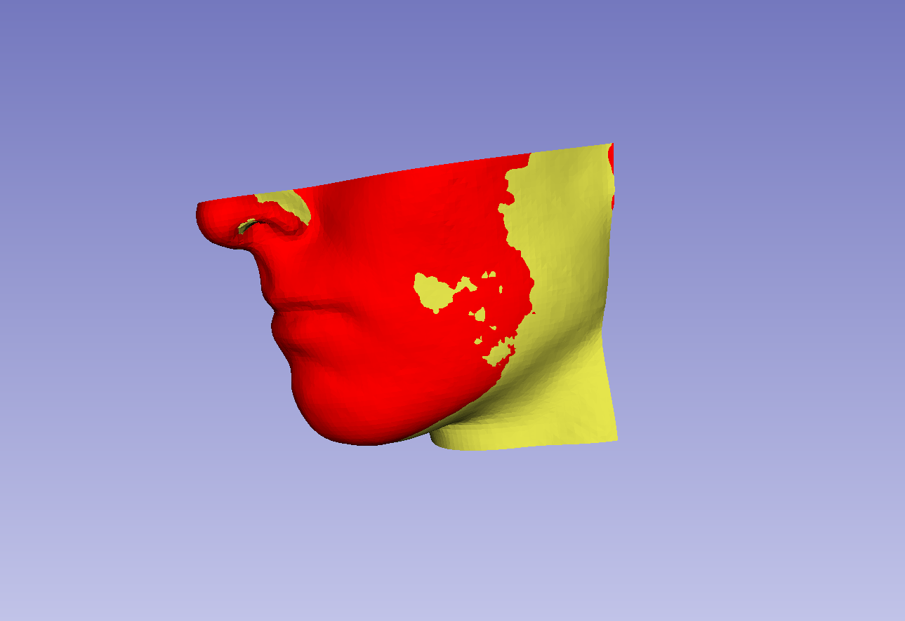

Back to [Projects List](../../README.md#ProjectsList)

# Mesh Comparison

## Key Investigators

- Paolo Zaffino (Magna Graecia University of Catanzaro, Italy)
- Maria Francesca Spadea (Institute of Biomedical Engineering, KIT - Karlsruher Institut für Technologie, Germany)
- Michela Destito (Magna Graecia University of Catanzaro, Italy)
- Amerigo Giudice, the clinical mind behind the idea (Magna Graecia University of Catanzaro, Italy)
- Anyone who wants to join (bring a coffee!) 

# Project Description

<!-- Add a short paragraph describing the project. -->

In oral surgey field it is important quantifying the level of swelling after a surgical procedure.
Several centers can easily acquire volumetric scans of the patient, both before and after the intervetion.
Slicer already offers several modules for dealing with surfares (including difference quantification), but lacks a tool for computing the volume between two meshes.
Our aim is to provide such a tool.

## Objective

<!-- Describe here WHAT you would like to achieve (what you will have as end result). -->

1. Write a module for computing the volume between two meshes.
1. Propose to integrate the developed module into a larger project (Slicer CMF?)
1. 

## Approach and Plan

<!-- Describe here HOW you would like to achieve the objectives stated above. -->

1. Write a module for computing volume between two meshes (they can be also "open-mesh")
1. Use pyvista library for task involving mesh
1. ...

## Progress and Next Steps

<!-- Update this section as you make progress, describing of what you have ACTUALLY DONE. If there are specific steps that you could not complete then you can describe them here, too. -->

1. TBD
1. ...
1. ...

# Illustrations

<!-- Add pictures and links to videos that demonstrate what has been accomplished.

-->

# Background and References

<!-- If you developed any software, include link to the source code repository. If possible, also add links to sample data, and to any relevant publications. -->
