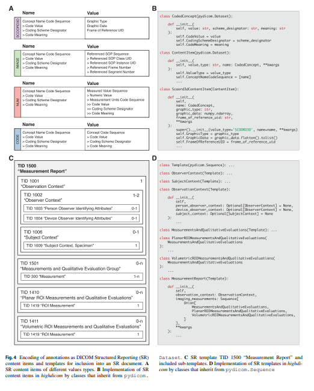

# Project Description

<!-- Add a short paragraph describing the project. -->

This project aims to create tutorials on how to work with DICOM annotations in pathology whole-slide images (WSIs). We will focus on region annotations stored as DICOM Structured Reports (SR) for a dataset of Rhabdomyosarcoma, which was recently ingested into the Imaging Data Commons (IDC).
If time permits we will continue working on nuclei annotations stored as DICOM Microscopy Bulk Simple Annotations (MBSA). This work was started in the last project week in Montreal, but hindered by technical issues (see [here](https://projectweek.na-mic.org/PW39_2023_Montreal/Projects/TutorialsOnWorkingWithDicomAnnotationsInPathologyWholeSlideImages/)).

## Objective

<!-- Describe here WHAT you would like to achieve (what you will have as end result). -->

1.  Objective A: Have a Colaboratory notebook ready that explains work with DICOM SR and uses the annotations for some exemplary use case.
2.  Objective B (optional): Have a Colaboratory notebook ready that exemplifies work with DICOM MBSA.

## Approach and Plan

<!-- Describe here HOW you would like to achieve the objectives stated above. -->

1.  Set-up Google Healthcare DICOM store holding the available DICOM SR annotations.
2.  to be defined

## Progress and Next Steps

<!-- Update this section as you make progress, describing of what you have ACTUALLY DONE.
     If there are specific steps that you could not complete then you can describe them here, too. -->

1.  Describe specific steps you **have actually done**.

# Illustrations

 \
*Overview DICOM structured reports IOD: Taken from https://doi.org/10.1038/s41467-023-37224-2.*

# Background and References

<!-- If you developed any software, include link to the source code repository.
     If possible, also add links to sample data, and to any relevant publications. -->

*No response*
